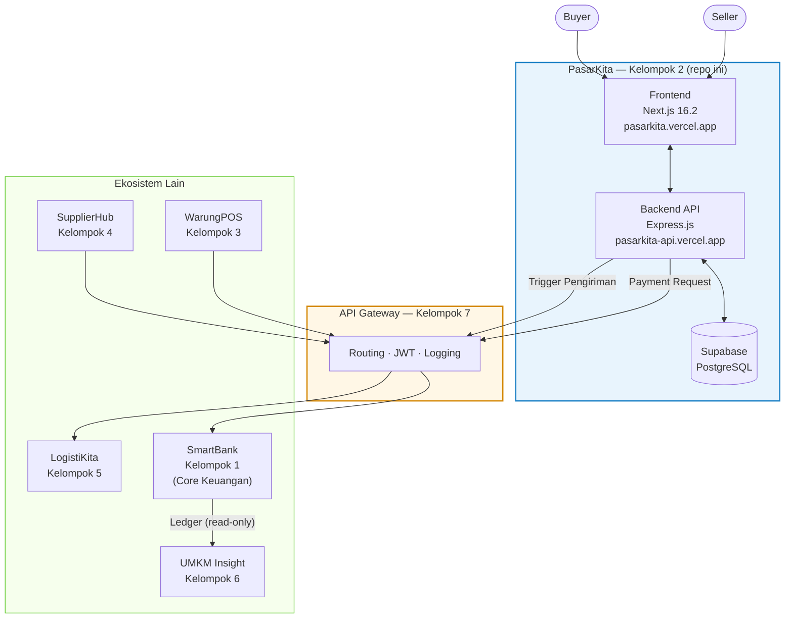
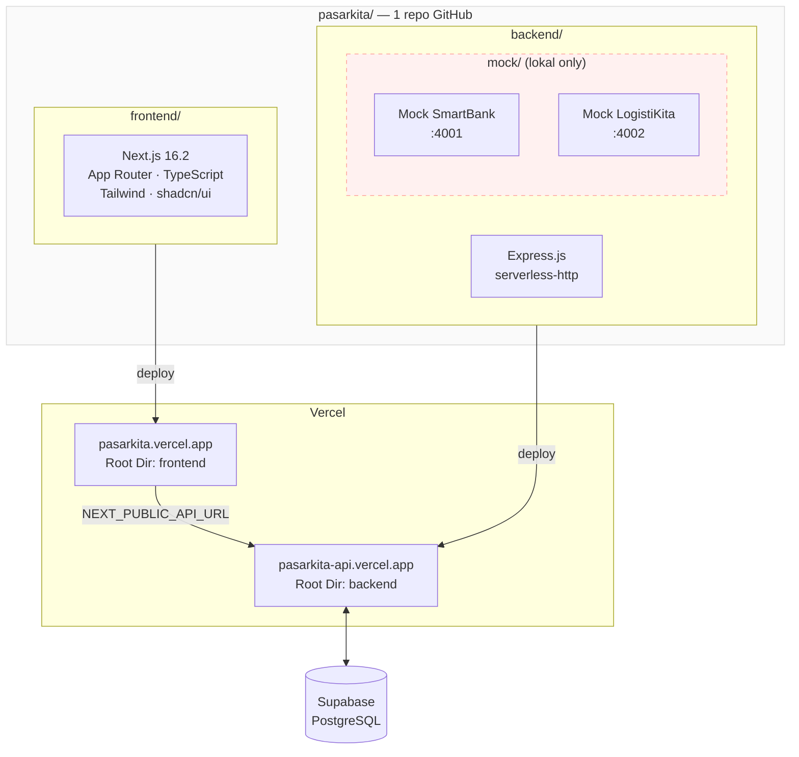
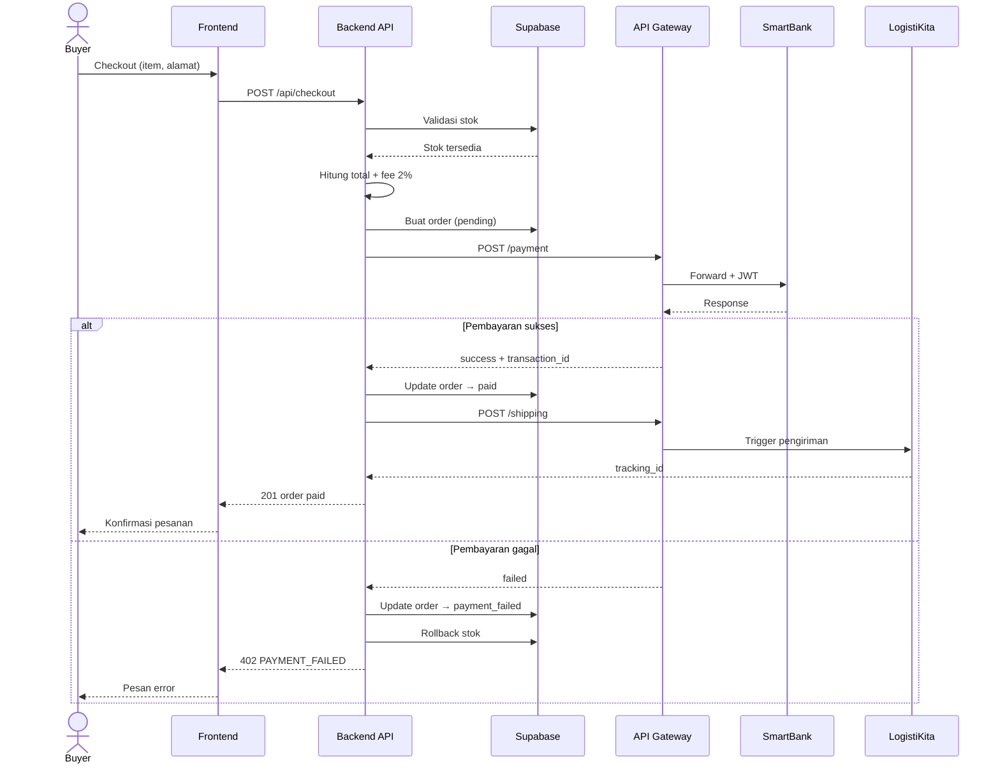

# PasarKita

Platform marketplace digital untuk produk UMKM — bagian dari ekosistem ekonomi UMKM pada mata kuliah Rekayasa Perangkat Lunak 2.

**Kelompok 2** · Dosen: M. Yusril Helmi Setyawan, S.Kom., M.Kom.

---

## Arsitektur Sistem

### Posisi dalam Ekosistem

PasarKita berperan sebagai **Demand Generator (B2C)** dalam ekosistem microservices antar kelompok. Semua transaksi keuangan diproses oleh SmartBank, dan semua komunikasi antar service melewati API Gateway.



### Arsitektur Internal Repo



### Alur Checkout



---

## Struktur Repo

```
pasarkita/
├── frontend/               # Next.js 16.2 — UI Marketplace
│   ├── app/                # App Router pages & layouts
│   ├── components/         # Reusable UI components
│   ├── store/              # Zustand (auth, cart)
│   ├── lib/                # API client, utils
│   ├── types/              # TypeScript types
│   └── package.json
│
├── backend/                # Express.js — REST API (deploy ke Vercel)
│   ├── api/
│   │   └── index.js        # Serverless entry point
│   ├── src/
│   │   ├── modules/        # products, orders, checkout, auth
│   │   ├── middlewares/    # auth, validate, errorHandler
│   │   ├── integrations/   # smartbank, logistikita
│   │   └── utils/          # fee, response
│   ├── vercel.json         # Konfigurasi Vercel routing
│   └── package.json
│
├── mock/                   # Dev tool — lokal only, tidak di-deploy
│   ├── smartbank/          # Mock SmartBank :4001
│   ├── logistikita/        # Mock LogistiKita :4002
│   └── package.json
│
└── README.md
```

---

## Tech Stack

| Layer | Teknologi |
|---|---|
| Frontend | Next.js 16.2, TypeScript, Tailwind CSS, shadcn/ui |
| State | Zustand, TanStack Query |
| Backend | Express.js, serverless-http |
| Database | Supabase (PostgreSQL) |
| Auth | JWT |
| Validasi | Zod, React Hook Form |
| Deploy | Vercel (frontend + backend, project terpisah) |
| Mock | Express.js (lokal only) |

---

## Cara Menjalankan

### Prasyarat

- Node.js v18+
- Akun Supabase
- Akun Vercel

### 1. Clone repo

```bash
git clone https://github.com/your-org/pasarkita.git
cd pasarkita
```

### 2. Setup Backend

```bash
cd backend
npm install
cp .env.example .env.development
# Isi environment variables di .env.development
npm run dev       # Berjalan di port 3001
```

### 3. Setup Frontend

```bash
cd frontend
npm install
cp .env.example .env.local
# Isi NEXT_PUBLIC_API_URL
npm run dev       # Berjalan di port 3000
```

### 4. Jalankan Mock Server (opsional, untuk dev lokal)

```bash
cd backend/mock
npm install
npm run all       # SmartBank :4001, LogistiKita :4002
```

---

## Environment Variables

### Backend (`backend/.env.development`)

```env
# Supabase
SUPABASE_URL=https://xxxx.supabase.co
SUPABASE_ANON_KEY=
SUPABASE_SERVICE_ROLE_KEY=

# JWT
JWT_SECRET=

# Service URLs (mock untuk dev, real untuk integration)
SMARTBANK_URL=http://localhost:4001/smartbank
LOGISTIKITA_URL=http://localhost:4002/logistikita
GATEWAY_BASE_URL=http://localhost:4000

# App
NODE_ENV=development
PORT=3001
```

### Frontend (`frontend/.env.local`)

```env
NEXT_PUBLIC_API_URL=http://localhost:3001
```

---

## Deploy ke Vercel

Buat **dua project Vercel** dari repo yang sama:

| Project | Root Directory | Environment |
|---|---|---|
| pasarkita-frontend | `frontend` | `NEXT_PUBLIC_API_URL` |
| pasarkita-backend | `backend` | semua backend env vars |

---

## API Endpoints

| Method | Endpoint | Auth | Deskripsi |
|---|---|---|---|
| POST | `/api/auth/register` | — | Registrasi user |
| POST | `/api/auth/login` | — | Login, return JWT |
| GET | `/api/products` | — | Browse semua produk |
| GET | `/api/products/:id` | — | Detail produk |
| POST | `/api/products` | seller | Tambah produk |
| PUT | `/api/products/:id` | seller / superadmin | Edit produk |
| DELETE | `/api/products/:id` | seller / superadmin | Hapus produk |
| POST | `/api/checkout` | buyer | Checkout & bayar |
| POST | `/api/fee/calculate` | — | Simulasi kalkulasi fee |
| GET | `/api/orders` | semua role | Daftar order |
| GET | `/api/orders/:id` | semua role | Detail order |
| PATCH | `/api/orders/:id/status` | superadmin | Update status order |
| GET | `/api/admin/users` | superadmin | Semua user |
| PATCH | `/api/admin/users/:id/status` | superadmin | Ban / aktifkan user |
| GET | `/api/admin/analytics` | superadmin | Dashboard analytics |

Dokumentasi lengkap di [`backend/PRD_Backend_PasarKita.md`](./backend/PRD_Backend_PasarKita.md).

---

## Role & Akses

| Role | Dibuat via | Akses |
|---|---|---|
| `buyer` | `/api/auth/register` | Browse, checkout, lihat order sendiri |
| `seller` | `/api/auth/register` | CRUD produk sendiri, lihat order masuk |
| `superadmin` | Insert manual ke Supabase | Semua akses + analytics + manajemen user |

---

## Aturan Keuangan Ekosistem

| Parameter | Nilai |
|---|---|
| Fee Marketplace | 2% dari subtotal |
| Saldo awal user | Rp 50.000 |
| Max transaksi harian | 10x per user |
| Cooldown transaksi | 10–30 detik |

---

## Dokumentasi

| Dokumen | Path | Deskripsi |
|---|---|---|
| PRD General | `PRD_v3_Marketplace_PasarKita.md` | Gambaran besar sistem |
| PRD Backend | `backend/PRD_Backend_PasarKita.md` | Spesifikasi API & database |
| PRD Frontend | `frontend/PRD_Frontend_PasarKita.md` | Design system & komponen |
| PRD Mock Server | `backend/mock/PRD_MockServer_PasarKita.md` | Setup & handler mock |

---

## Tim

| Nama | Npm | Role |
|---|---|---|
| Ridwan Hakim Ramadhan | — | — |
| Raditya Rizki Raharja | 714240041 | — |
| Muhammad Rashid Al Savero | — | — |

---

## Lisensi

Proyek ini dibuat untuk keperluan tugas besar mata kuliah RPL 2.
