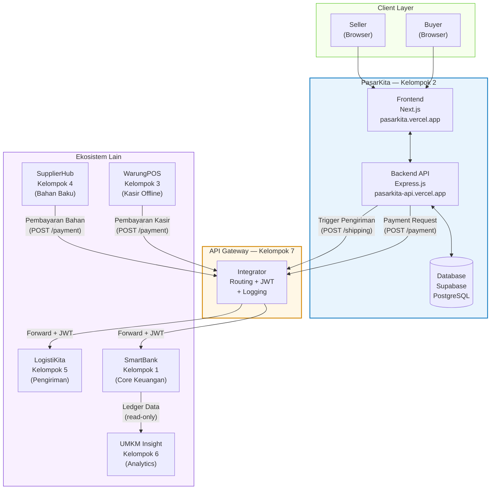
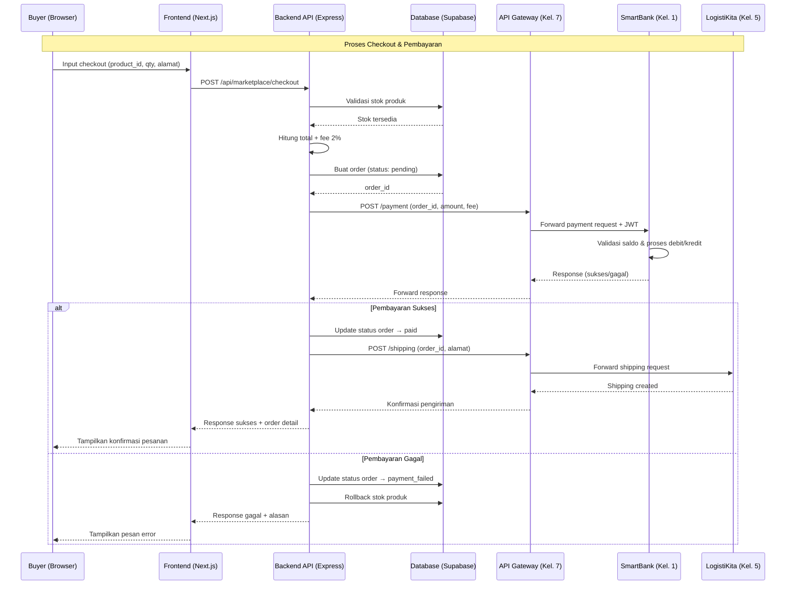
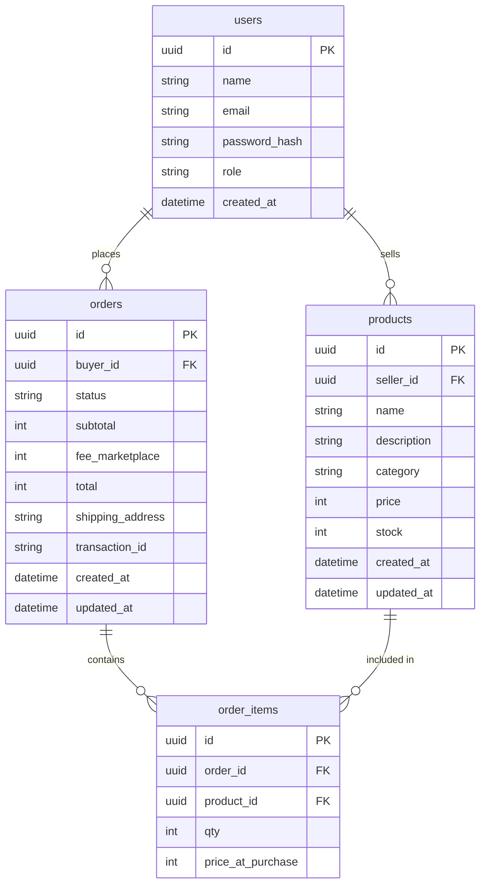

## Marketplace — PasarKita

**Mata Kuliah:** Rekayasa Perangkat Lunak 2
**Dosen:** M. Yusril Helmi Setyawan, S.Kom., M.Kom.
**Kelompok:** 2 — PasarKita (Marketplace)
**Versi:** 3.0
**Tanggal:** 18 April 2026

---

## 1. Overview

Aplikasi ini merupakan bagian dari ekosistem ekonomi UMKM yang dikembangkan secara kolaboratif dalam mata kuliah RPL 2. PasarKita hadir sebagai kanal jual beli digital yang menghubungkan seller UMKM dengan buyer, di mana seluruh aliran uang dikendalikan secara terpusat oleh SmartBank sebagai satu-satunya otoritas keuangan dalam ekosistem.

Masalah utama yang diselesaikan adalah kebutuhan akan platform transaksi B2C yang terintegrasi dalam ekosistem microservices — di mana setiap pembayaran tidak boleh diproses langsung oleh Marketplace, melainkan harus dikirimkan sebagai payment request ke SmartBank melalui API Gateway.

Tujuan utama aplikasi adalah menyediakan platform Marketplace berbasis web bagi **Seller** untuk mengelola produk dan bagi **Buyer** untuk menelusuri produk dan melakukan pembelian, dengan mekanisme pembayaran yang sepenuhnya terhubung ke ekosistem SmartBank.

---

## 2. Requirements

Berikut adalah persyaratan tingkat tinggi untuk pengembangan sistem:

- **Aksesibilitas:** Aplikasi harus dapat diakses melalui Web Browser (desktop dan mobile).
- **Pengguna:** Sistem memiliki dua jenis pengguna — **Seller** (mengelola produk) dan **Buyer** (melakukan pembelian).
- **Pembayaran:** Semua transaksi keuangan wajib dikirimkan sebagai payment request ke SmartBank melalui API Gateway. Marketplace tidak boleh memproses pembayaran secara langsung.
- **Fee:** Marketplace memotong fee sebesar **2%** dari setiap transaksi penjualan yang berhasil.
- **Integrasi:** Setelah pembayaran sukses, Marketplace wajib memicu LogistiKita untuk memulai proses pengiriman.
- **Database:** Database milik Marketplace sepenuhnya terpisah dari aplikasi lain dalam ekosistem.
- **Komunikasi:** Semua request antar service wajib melalui API Gateway (JWT validation + logging).
- **Batasan Transaksi:** Maksimal 10 transaksi per user per hari, dengan cooldown 10–30 detik antar transaksi.

---

## 3. Core Features

Fitur-fitur kunci yang harus ada dalam versi pertama (MVP):

1. **Manajemen Produk (Seller)**
   - Seller dapat menambah, mengedit, dan menghapus produk.
   - Kolom wajib: Nama Produk, Deskripsi, Harga, Stok, Kategori, dan Foto Produk (opsional).

2. **Browse Produk (Buyer)**
   - Buyer dapat menelusuri semua produk yang tersedia.
   - Fitur pencarian berdasarkan nama dan filter berdasarkan kategori.

3. **Checkout**
   - Buyer memilih produk dan jumlah yang ingin dibeli.
   - Sistem menghitung subtotal + fee marketplace 2% secara otomatis.
   - Validasi stok tersedia sebelum melanjutkan pembayaran.

4. **Integrasi Pembayaran ke SmartBank**
   - Sistem mengirimkan payment request ke SmartBank via API Gateway.
   - Sistem menangani response sukses maupun gagal dari SmartBank.
   - Jika sukses, status order diperbarui dan LogistiKita dipicu.

5. **Status Order**
   - Buyer dapat memantau status pesanan secara real-time.
   - Status: `pending` → `paid` → `shipped` → `delivered` (atau `payment_failed`).

6. **Biaya Layanan Marketplace**
   - Fee 2% dihitung otomatis dari subtotal transaksi.
   - Disertakan dalam metadata payment request ke SmartBank.

---

## 4. User Flow

### 4.1 Alur Seller

1. **Login:** Seller masuk menggunakan akun yang telah terdaftar.
2. **Kelola Produk:** Seller menambah produk baru dengan mengisi nama, harga, stok, dan kategori.
3. **Monitor:** Seller memantau produk yang terjual melalui daftar order masuk.

### 4.2 Alur Buyer

1. **Login:** Buyer masuk menggunakan akun yang terdaftar di ekosistem.
2. **Browse:** Buyer menelusuri produk, menggunakan search atau filter kategori.
3. **Checkout:** Buyer memilih produk dan jumlah, sistem menampilkan total + fee 2%.
4. **Pembayaran:** Sistem mengirim payment request ke SmartBank via Gateway.
5. **Konfirmasi:** Jika pembayaran sukses, status order berubah menjadi `paid` dan pengiriman dipicu ke LogistiKita.
6. **Tracking:** Buyer memantau status pesanan hingga `delivered`.

---

## 5. Architecture

### 5.1 Diagram Arsitektur Sistem

Diagram berikut menggambarkan posisi PasarKita dalam ekosistem microservices secara keseluruhan, beserta arah komunikasi antar service.



**Keterangan:**
- **PasarKita (biru)** — scope pengerjaan kelompok 2, terdiri dari frontend, backend API, dan database sendiri
- **API Gateway (kuning)** — semua komunikasi keluar dari Marketplace wajib melalui node ini
- **Ekosistem Lain (ungu)** — service milik kelompok lain, Marketplace hanya berinteraksi dengan SmartBank dan LogistiKita
- Panah menunjukkan arah request, bukan arah data

---

### 5.2 Alur Checkout (Sequence Diagram)



### 5.3 Deployment Architecture

```
[Repo 1] Frontend (Next.js)       →  Vercel  (pasarkita.vercel.app)
[Repo 2] Backend API (Express.js) →  Vercel  (pasarkita-api.vercel.app)
[Managed] Database (PostgreSQL)   →  Supabase
[Lokal]   Mock SmartBank          →  json-server (dev only)
[Lokal]   Mock LogistiKita        →  json-server (dev only)
```

### 5.4 Integrasi Antar Aplikasi

PasarKita terhubung dengan 3 aplikasi lain dalam ekosistem:

| Aplikasi | Kelompok | Arah Komunikasi | Keperluan |
|---|---|---|---|
| SmartBank | 1 | Marketplace → SmartBank | Kirim payment request saat checkout |
| LogistiKita | 5 | Marketplace → LogistiKita | Trigger pengiriman setelah pembayaran sukses |
| API Gateway | 7 | Semua request lewat Gateway | Routing, JWT validation, logging |

### 5.5 Kontrak API Keluar (Outbound)

**Request ke SmartBank:**

```json
POST /api/gateway/smartbank/payment

{
  "from_app": "marketplace",
  "from_user": "user_123",
  "to_user": "seller_456",
  "amount": 102000,
  "fee_marketplace": 2000,
  "metadata": {
    "order_id": "ORD-001",
    "items": [
      { "product_id": "PRD-001", "qty": 2, "price": 50000 }
    ]
  }
}
```

**Request ke LogistiKita:**

```json
POST /api/gateway/logistikita/shipping

{
  "order_id": "ORD-001",
  "from_address": "Alamat seller",
  "to_address": "Alamat buyer",
  "items_count": 2,
  "total_weight": 1.5
}
```

> **Catatan:** Format di atas bersifat tentatif dan harus disesuaikan setelah koordinasi dengan kelompok terkait.

---

## 6. Database Schema

Berikut adalah Entity Relationship Diagram (ERD) yang menggambarkan struktur database Marketplace:



| Tabel | Deskripsi |
|---|---|
| **users** | Data seller dan buyer yang terdaftar di Marketplace |
| **products** | Master data produk milik seller, menyimpan info harga, stok, dan kategori |
| **orders** | Mencatat setiap transaksi pembelian beserta status pembayaran dan pengiriman |
| **order_items** | Detail item per order dengan harga pada saat pembelian (price snapshot) |

---

## 7. Aturan Keuangan

### 7.1 Parameter Keuangan yang Berlaku

| Parameter | Nilai | Keterangan |
|---|---|---|
| Fee Marketplace | 2% | Dipotong dari transaksi penjualan, menjadi revenue marketplace |
| Fee Bank | 1% | Dipotong oleh SmartBank, bukan oleh Marketplace |
| Fee Gateway | 0.5% | Dipotong oleh Gateway per request |
| Pajak Sistem | 2% | Dipotong sebagai money sink |
| Saldo Awal User | Rp 50.000 | Saldo awal setiap user saat registrasi di SmartBank |
| Max Transaksi Harian | 10 transaksi | Per user per hari |
| Cooldown Transaksi | 10–30 detik | Jeda minimum antar transaksi |

### 7.2 Simulasi Biaya Transaksi

**Skenario: User membeli produk seharga Rp 100.000**

| Komponen | Nominal | Pihak yang Memotong |
|---|---|---|
| Harga produk | Rp 100.000 | — |
| Fee Marketplace (2%) | Rp 2.000 | Marketplace |
| Fee Bank (1%) | Rp 1.000 | SmartBank |
| Fee Gateway (0.5%) | Rp 500 | API Gateway |
| Pajak Sistem (2%) | Rp 2.000 | SmartBank |
| **Total debit dari buyer** | **Rp 105.500** | — |

> **Catatan:** Marketplace hanya bertanggung jawab menghitung dan menyertakan fee 2%. Fee lainnya diproses oleh SmartBank dan Gateway.

### 7.3 Implikasi terhadap Development

- Setiap endpoint checkout harus menghitung fee 2% secara otomatis.
- Sistem harus mengecek cooldown transaksi sebelum memproses checkout baru.
- Sistem harus melacak jumlah transaksi harian per user.
- Harga produk harus realistis dalam range saldo awal Rp 50.000.

---

## 8. Strategi Testing

### 8.1 Environment Testing

| Environment | Marketplace | SmartBank | LogistiKita | Tujuan |
|---|---|---|---|---|
| Development | Lokal | Mock (json-server) | Mock (json-server) | Unit test & feature dev |
| Integration | Lokal / Vercel | Server asli (dev) | Server asli (dev) | Test koneksi antar kelompok |
| Demo | Vercel | Server asli | Server asli | Presentasi ke dosen |

### 8.2 Mock Server Setup

Mock server berjalan secara lokal selama development dan mensimulasikan response dari SmartBank dan LogistiKita.

**Mock SmartBank** harus mencakup skenario:

- Payment sukses (saldo cukup)
- Payment gagal (saldo tidak cukup)
- Payment gagal (limit transaksi harian tercapai)
- Payment gagal (cooldown belum selesai)
- Response timeout / server error

**Mock LogistiKita** harus mencakup skenario:

- Pengiriman berhasil dibuat
- Pengiriman gagal (alamat tidak valid)
- Response timeout / server error

### 8.3 Skenario Test Case per Fitur

**Manajemen Produk:**

| # | Skenario | Expected Output |
|---|---|---|
| 1 | Tambah produk dengan data valid | Produk tersimpan, return 201 |
| 2 | Tambah produk dengan field kosong | Validasi error, return 400 |
| 3 | Edit produk milik sendiri | Produk terupdate, return 200 |
| 4 | Edit produk milik seller lain | Forbidden, return 403 |
| 5 | Hapus produk yang punya order aktif | Error, return 409 |

**Checkout:**

| # | Skenario | Expected Output |
|---|---|---|
| 1 | Checkout dengan stok tersedia | Order terbuat, payment request terkirim |
| 2 | Checkout dengan stok habis | Error stok, return 400 |
| 3 | Checkout qty melebihi stok | Error stok, return 400 |
| 4 | Fee 2% dihitung dengan benar | Total = subtotal × 1.02 |
| 5 | Checkout saat cooldown aktif | Error cooldown, return 429 |
| 6 | Checkout saat limit harian tercapai | Error limit, return 429 |

**Integrasi Pembayaran:**

| # | Skenario | Expected Output |
|---|---|---|
| 1 | Payment sukses dari SmartBank | Status order → paid, trigger LogistiKita |
| 2 | Payment gagal (saldo tidak cukup) | Status order → payment_failed, stok rollback |
| 3 | SmartBank timeout | Order tetap pending, bisa retry |
| 4 | JWT tidak valid | Request ditolak Gateway, return 401 |

**Status Order:**

| # | Skenario | Expected Output |
|---|---|---|
| 1 | Lihat order milik sendiri | Return detail order |
| 2 | Lihat order milik orang lain | Forbidden, return 403 |
| 3 | Filter order by status | Return order sesuai filter |

### 8.4 Koordinasi Pre-Integration Test

Sebelum integration test dengan kelompok lain, hal-hal berikut harus disepakati:

- Format request & response JSON antar service
- URL endpoint SmartBank, LogistiKita, dan Gateway
- Mekanisme autentikasi JWT (format token, secret key, expiry)
- Daftar error code dan message standar
- Akun test khusus dengan saldo lebih tinggi untuk keperluan testing

---

## 9. Risiko & Mitigasi

| Risiko | Dampak | Mitigasi |
|---|---|---|
| SmartBank belum siap saat development | Tidak bisa test integrasi payment | Gunakan mock server selama development |
| Format API tidak konsisten antar kelompok | Integrasi gagal saat digabungkan | Sepakati kontrak API sedini mungkin |
| Cold start Vercel saat demo | Response lambat di request pertama | Hit endpoint sekali sebelum demo dimulai |
| Saldo test habis karena fee bertumpuk | Tidak bisa test checkout berulang | Minta akun test khusus ke kelompok SmartBank |
| Database Supabase down | Seluruh service tidak bisa diakses | Monitoring status Supabase, backup data reguler |

---

## 10. Milestone & Timeline

| Fase | Deliverable | Target |
|---|---|---|
| Fase 1 — Setup | Setup repo, Supabase, Vercel, mock server | Minggu 1 |
| Fase 2 — Core API | Endpoint CRUD produk, browse, checkout | Minggu 2–3 |
| Fase 3 — Integrasi Mock | Payment flow dengan mock SmartBank & LogistiKita | Minggu 3–4 |
| Fase 4 — Frontend | UI Marketplace (browse, checkout, order status) | Minggu 4–5 |
| Fase 5 — Integration Test | Test dengan kelompok SmartBank, Gateway, LogistiKita | Minggu 5–6 |
| Fase 6 — Dokumentasi & Demo | Lengkapi 12 bagian dokumen, persiapan demo | Minggu 6–7 |

> **Catatan:** Timeline bersifat estimasi dan dapat disesuaikan berdasarkan jadwal mata kuliah.

---

## 11. Design & Technical Constraints

Bagian ini mengatur batasan teknis dan panduan desain yang harus dipatuhi selama pengembangan.

1. **High-Level Technology:**
   Sistem dibangun menggunakan **Next.js** untuk frontend dan **Express.js** (dengan `serverless-http`) untuk backend API, keduanya di-deploy di Vercel sebagai dua project terpisah. Database menggunakan **Supabase (PostgreSQL)**. Pemisahan ini menjaga prinsip microservices di level internal kelompok, di mana frontend dan backend memiliki URL berbeda dan dapat dikembangkan secara independen.

2. **API Communication Rules:**
   Semua request keluar dari Marketplace ke service lain (SmartBank, LogistiKita) wajib melalui API Gateway dan menyertakan JWT token yang valid. Format request dan response menggunakan **JSON**. Setiap endpoint harus memvalidasi input dan mencatat log request.

3. **Financial Rules:**
   Marketplace hanya bertanggung jawab menghitung dan menyertakan fee 2% dalam payment request. Tidak ada kalkulasi atau pemotongan fee lain yang boleh dilakukan di sisi Marketplace. Saldo tidak boleh diubah secara langsung — semua perubahan saldo hanya melalui SmartBank.

4. **Stateless Backend:**
   Karena backend berjalan sebagai serverless function di Vercel, tidak ada in-memory state antar request. Semua data harus disimpan ke Supabase. Timeout maksimal per request adalah 10 detik.

5. **Typography Rules:**
   Sistem antarmuka (UI) wajib menggunakan konfigurasi font variable sebagai berikut untuk menjaga konsistensi visual:
   - **Sans:** `Inter, ui-sans-serif, sans-serif`
   - **Mono:** `JetBrains Mono, monospace`
