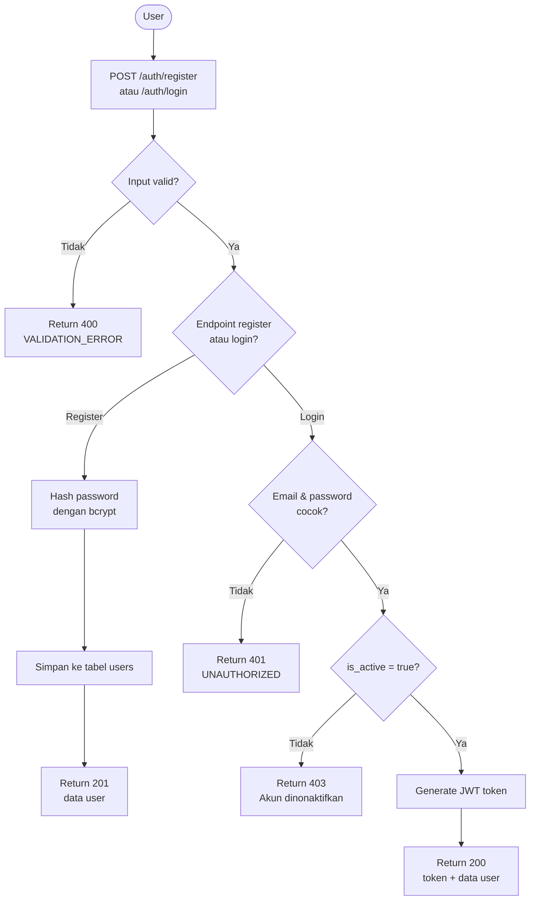
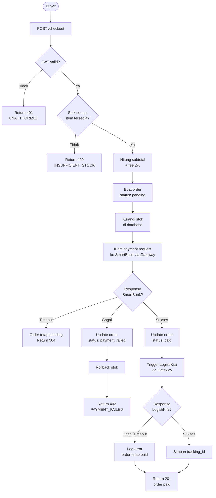
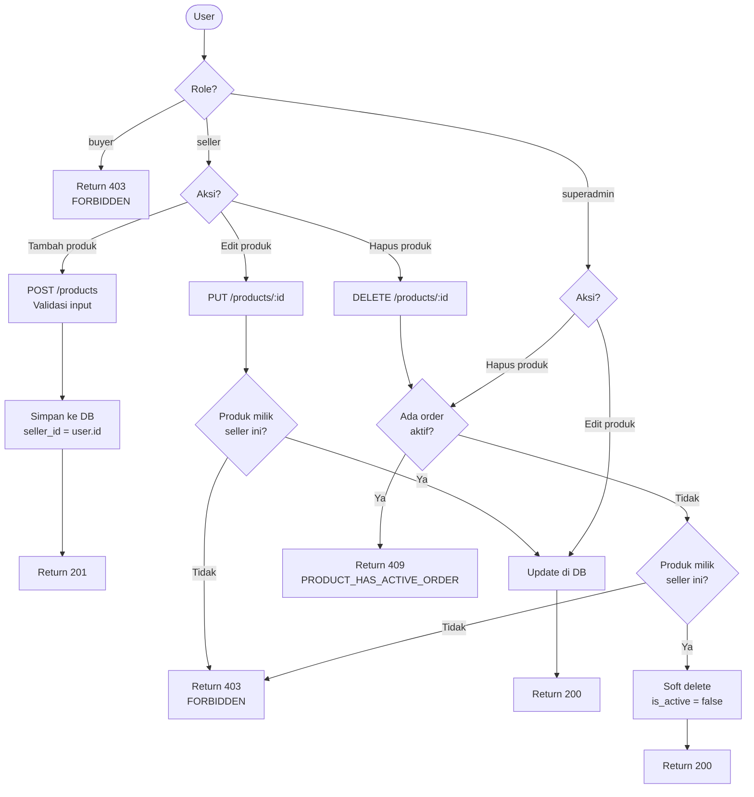
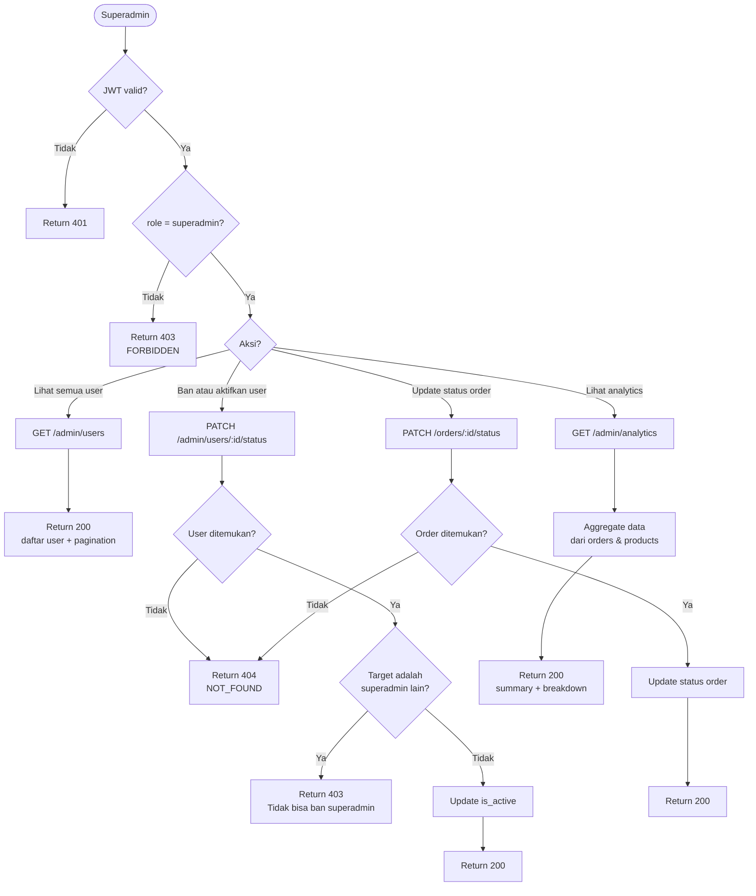
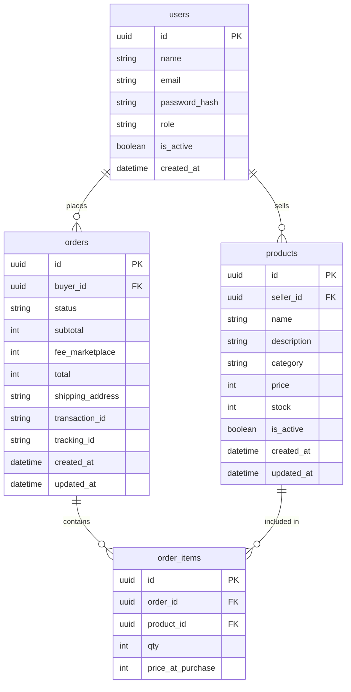

# PRD — Backend API

## Marketplace — PasarKita

**Mata Kuliah:** Rekayasa Perangkat Lunak 2
**Dosen:** M. Yusril Helmi Setyawan, S.Kom., M.Kom.
**Kelompok:** 2 — PasarKita (Marketplace)
**Dokumen:** Backend API Specification
**Versi:** 2.0
**Tanggal:** 20 Juli 2026 (updated - MySQL migration)

---

## 1. Overview

Dokumen ini mendeskripsikan spesifikasi teknis backend API PasarKita secara menyeluruh — mencakup arsitektur server, struktur folder, daftar endpoint, business logic, integrasi ke service eksternal, penanganan error, dan aturan keamanan.

Backend PasarKita dibangun menggunakan **Express.js** yang di-deploy di Vercel sebagai serverless function menggunakan `serverless-http`. Backend berada di subfolder `backend/` dalam satu repo GitHub bersama frontend, di-deploy sebagai project Vercel terpisah dengan Root Directory di-set ke `backend`. Semua data disimpan di **MySQL 8.0+** (migrated from Supabase PostgreSQL on July 7, 2026). Mock server untuk testing lokal berada di `mock/` (root repo) dan tidak pernah di-deploy.

---

## 2. Tech Stack

| Komponen | Teknologi | Keterangan |
|---|---|---|
| Runtime | Node.js | v18+ |
| Framework | Express.js 5.2.1 | REST API |
| Serverless Adapter | serverless-http | Agar bisa deploy di Vercel |
| Database | MySQL 8.0+ | Managed MySQL (migrated from PostgreSQL July 2026) |
| Database Driver | mysql2 | Connection pooling, promise wrapper |
| Autentikasi | JWT | Library `jsonwebtoken` |
| Password Hashing | bcrypt | User password security |
| Validasi Input | Zod | Schema validation |
| HTTP Client | Axios | Request ke SmartBank & LogistiKita |
| File Upload | Multer | Product images, store logos |
| Environment Config | dotenv | Manage environment variables |

---

## 3. Struktur Folder

Backend berada di subfolder `backend/` dalam repo `pasarkita`:

```
pasarkita/                          ← root repo
├── frontend/                       ← Next.js (lihat PRD Frontend)
├── backend/                        ← Express.js (scope dokumen ini)
│   ├── api/
│   │   └── index.js                # Entry point — wrap Express dengan serverless-http
│   ├── src/
│   │   ├── app.js                  # Setup Express, middleware, dan routing
│   │   ├── config/
│   │   │   ├── mysql.js            # MySQL connection pool
│   │   │   └── env.js              # Validasi environment variables
│   │   ├── middlewares/
│   │   │   ├── auth.js             # Verifikasi JWT token
│   │   │   ├── validate.js         # Middleware validasi input (Zod)
│   │   │   └── errorHandler.js     # Global error handler
│   │   ├── modules/
│   │   │   ├── products/
│   │   │   │   ├── product.routes.js
│   │   │   │   ├── product.controller.js
│   │   │   │   └── product.service.js
│   │   │   ├── orders/
│   │   │   │   ├── order.routes.js
│   │   │   │   ├── order.controller.js
│   │   │   │   └── order.service.js
│   │   │   ├── checkout/
│   │   │   │   ├── checkout.routes.js
│   │   │   │   ├── checkout.controller.js
│   │   │   │   └── checkout.service.js
│   │   │   └── auth/
│   │   │       ├── auth.routes.js
│   │   │       ├── auth.controller.js
│   │   │       └── auth.service.js
│   │   ├── integrations/
│   │   │   ├── smartbank.js        # Request ke SmartBank via Gateway
│   │   │   └── logistikita.js      # Request ke LogistiKita via Gateway
│   │   └── utils/
│   │       ├── response.js         # Standarisasi format response
│   │       └── fee.js              # Kalkulasi fee marketplace
│   ├── vercel.json                 # Konfigurasi Vercel routing
│   ├── package.json
│   └── .env.example
└── README.md
```

**Vercel deployment** — buat project baru di Vercel, pilih repo `pasarkita`, lalu set:
```
Root Directory: backend
```

---

## 4. Environment Variables

```env
# MySQL
MYSQL_HOST=localhost
MYSQL_PORT=3306
MYSQL_USER=your_mysql_user
MYSQL_PASSWORD=your_mysql_password
MYSQL_DATABASE=pasarkita

# JWT
JWT_SECRET=your_jwt_secret

# Integrations
GATEWAY_BASE_URL=https://gateway.vercel.app/api
GATEWAY_API_KEY=your_gateway_api_key
SMARTBANK_URL=http://localhost:4001/smartbank       # dev only
LOGISTIKITA_URL=http://localhost:4002/logistikita   # dev only
MOCK_DEV_SECRET=mock-dev-secret                      # dev only

# App
NODE_ENV=development
PORT=3001
```

**Catatan:**
- `SMARTBANK_URL` dan `LOGISTIKITA_URL` hanya digunakan untuk direct mock saat `NODE_ENV=development`
- Environment staging/production selalu melalui `GATEWAY_BASE_URL` sesuai aturan integrasi
- MySQL credentials production disimpan di Vercel environment variables, jangan commit ke repo

---

## 5. Konfigurasi Vercel

```json
{
  "version": 2,
  "builds": [
    {
      "src": "api/index.js",
      "use": "@vercel/node"
    }
  ],
  "rewrites": [
    {
      "source": "/api/(.*)",
      "destination": "/api/index.js"
    }
  ]
}
```

---

## 6. Standar Response API

Semua endpoint menggunakan format response yang konsisten:

**Response Sukses:**

```json
{
  "success": true,
  "message": "Produk berhasil ditambahkan",
  "data": { ... }
}
```

**Response Gagal:**

```json
{
  "success": false,
  "message": "Stok produk tidak mencukupi",
  "error": {
    "code": "INSUFFICIENT_STOCK",
    "details": "Stok tersedia: 2, diminta: 5"
  }
}
```

**Pagination:**

```json
{
  "success": true,
  "data": [ ... ],
  "pagination": {
    "page": 1,
    "limit": 10,
    "total": 42,
    "total_pages": 5
  }
}
```

---

## 7. Autentikasi & Middleware

### 7.1 JWT Authentication

Semua endpoint yang memerlukan autentikasi harus menyertakan header:

```
Authorization: Bearer <token>
```

Middleware `auth.js` akan memverifikasi token sebelum request masuk ke controller.

```javascript
// src/middlewares/auth.js
const verifyToken = async (req, res, next) => {
  const token = req.headers.authorization?.split(' ')[1]
  if (!token) return res.status(401).json({ success: false, message: 'Token tidak ditemukan' })

  try {
    const decoded = jwt.verify(token, process.env.JWT_SECRET)
    req.user = decoded
    next()
  } catch (err) {
    return res.status(401).json({ success: false, message: 'Token tidak valid atau sudah expired' })
  }
}
```

### 7.2 Role-Based Access

| Role | Akses |
|---|---|
| `buyer` | Browse produk, checkout, lihat order sendiri |
| `seller` | CRUD produk sendiri, lihat order masuk |
| `superadmin` | Manage semua produk, semua order, semua user, akses dashboard analytics internal |

### 7.3 Superadmin Middleware

Superadmin tidak punya endpoint registrasi — akun dibuat langsung di database MySQL saat setup awal (lihat section 13.3). Middleware `requireSuperadmin` digunakan untuk memproteksi endpoint yang hanya boleh diakses superadmin:

```javascript
// src/middlewares/auth.js
const requireSuperadmin = (req, res, next) => {
  if (req.user.role !== 'superadmin') {
    return res.status(403).json({
      success: false,
      message: 'Akses ditolak. Hanya superadmin yang dapat mengakses endpoint ini',
      error: { code: 'FORBIDDEN' }
    })
  }
  next()
}
```

Penggunaan di route:

```javascript
// Endpoint khusus superadmin
router.get('/admin/users', verifyToken, requireSuperadmin, userController.getAllUsers)
router.get('/admin/analytics', verifyToken, requireSuperadmin, analyticsController.getDashboard)

// Endpoint yang bisa diakses seller DAN superadmin
router.put('/products/:id', verifyToken, productController.updateProduct)
// → pengecekan kepemilikan dilakukan di controller, superadmin di-bypass
```

### 7.4 Global Error Handler

```javascript
// src/middlewares/errorHandler.js
const errorHandler = (err, req, res, next) => {
  const status = err.status || 500
  res.status(status).json({
    success: false,
    message: err.message || 'Internal server error',
    error: {
      code: err.code || 'INTERNAL_ERROR'
    }
  })
}
```

---

## 8. Daftar Endpoint

### 8.1 Auth

| Method | Endpoint | Auth | Deskripsi |
|---|---|---|---|
| POST | `/api/auth/register` | ✗ | Registrasi user baru |
| POST | `/api/auth/login` | ✗ | Login, return JWT token |
| GET | `/api/auth/me` | ✓ | Data user yang sedang login |

---

**POST /api/auth/register**

Request:
```json
{
  "name": "Budi Santoso",
  "email": "budi@email.com",
  "password": "password123",
  "role": "buyer"
}
```

Response `201`:
```json
{
  "success": true,
  "message": "Registrasi berhasil",
  "data": {
    "id": "uuid",
    "name": "Budi Santoso",
    "email": "budi@email.com",
    "role": "buyer"
  }
}
```

---

**POST /api/auth/login**

Request:
```json
{
  "email": "budi@email.com",
  "password": "password123"
}
```

Response `200`:
```json
{
  "success": true,
  "message": "Login berhasil",
  "data": {
    "token": "eyJhbGciOiJIUzI1NiIsInR5cCI6IkpXVCJ9...",
    "user": {
      "id": "uuid",
      "name": "Budi Santoso",
      "role": "buyer"
    }
  }
}
```

---

### 8.2 Products

| Method | Endpoint | Auth | Role | Deskripsi |
|---|---|---|---|---|
| GET | `/api/products` | ✗ | — | Ambil semua produk (public) |
| GET | `/api/products/:id` | ✗ | — | Detail satu produk |
| POST | `/api/products` | ✓ | seller | Tambah produk baru |
| PUT | `/api/products/:id` | ✓ | seller / superadmin | Edit produk (seller: milik sendiri, superadmin: semua) |
| DELETE | `/api/products/:id` | ✓ | seller / superadmin | Hapus produk (seller: milik sendiri, superadmin: semua) |

---

**GET /api/products**

Query params:
```
?search=baju&category=fashion&sort=price_asc&page=1&limit=10
```

Response `200`:
```json
{
  "success": true,
  "data": [
    {
      "id": "uuid",
      "name": "Baju Batik",
      "description": "Batik tulis asli Solo",
      "category": "fashion",
      "price": 45000,
      "stock": 10,
      "seller": {
        "id": "uuid",
        "name": "Toko Batik Indah"
      }
    }
  ],
  "pagination": {
    "page": 1,
    "limit": 10,
    "total": 42,
    "total_pages": 5
  }
}
```

---

**POST /api/products**

Request:
```json
{
  "name": "Baju Batik",
  "description": "Batik tulis asli Solo",
  "category": "fashion",
  "price": 45000,
  "stock": 10
}
```

Response `201`:
```json
{
  "success": true,
  "message": "Produk berhasil ditambahkan",
  "data": {
    "id": "uuid",
    "name": "Baju Batik",
    "price": 45000,
    "stock": 10,
    "seller_id": "uuid",
    "created_at": "2026-04-18T10:00:00Z"
  }
}
```

---

**PUT /api/products/:id**

Request:
```json
{
  "price": 50000,
  "stock": 8
}
```

Response `200`:
```json
{
  "success": true,
  "message": "Produk berhasil diperbarui",
  "data": { ... }
}
```

Error `403` jika produk bukan milik seller yang login dan bukan superadmin:
```json
{
  "success": false,
  "message": "Akses ditolak",
  "error": { "code": "FORBIDDEN" }
}
```

> **Catatan:** Superadmin dapat mengedit produk milik seller manapun — pengecekan kepemilikan di-bypass jika `req.user.role === 'superadmin'`.

---

**DELETE /api/products/:id**

Response `200`:
```json
{
  "success": true,
  "message": "Produk berhasil dihapus"
}
```

Error `409` jika produk punya order aktif:
```json
{
  "success": false,
  "message": "Produk tidak dapat dihapus karena memiliki order aktif",
  "error": { "code": "PRODUCT_HAS_ACTIVE_ORDER" }
}
```

---

### 8.3 Checkout

| Method | Endpoint | Auth | Role | Deskripsi |
|---|---|---|---|---|
| POST | `/api/checkout` | ✓ | buyer | Proses checkout & kirim ke SmartBank |

---

**POST /api/checkout**

Request:
```json
{
  "items": [
    { "product_id": "uuid", "qty": 2 }
  ],
  "shipping_address": "Jl. Merdeka No. 1, Bandung"
}
```

Proses internal:
1. Validasi stok semua item
2. Hitung subtotal
3. Hitung fee marketplace (2% dari subtotal)
4. Cek cooldown transaksi user (10–30 detik)
5. Cek limit transaksi harian user (max 10)
6. Buat order dengan status `pending`
7. Kirim payment request ke SmartBank via Gateway
8. Jika sukses → update order ke `paid`, trigger LogistiKita
9. Jika gagal → update order ke `payment_failed`, rollback stok

Response `201` (sukses):
```json
{
  "success": true,
  "message": "Checkout berhasil",
  "data": {
    "order_id": "ORD-uuid",
    "status": "paid",
    "subtotal": 90000,
    "fee_marketplace": 1800,
    "total": 91800,
    "transaction_id": "TXN-smartbank-001",
    "shipping": {
      "tracking_id": "SHP-logistikita-001",
      "status": "created"
    }
  }
}
```

Response `400` (stok tidak cukup):
```json
{
  "success": false,
  "message": "Stok produk tidak mencukupi",
  "error": {
    "code": "INSUFFICIENT_STOCK",
    "details": "Produk 'Baju Batik': stok tersedia 1, diminta 2"
  }
}
```

Response `402` (saldo tidak cukup dari SmartBank):
```json
{
  "success": false,
  "message": "Pembayaran gagal: saldo tidak mencukupi",
  "error": {
    "code": "PAYMENT_FAILED",
    "details": "Response dari SmartBank: INSUFFICIENT_BALANCE"
  }
}
```

---

### 8.4 Orders

| Method | Endpoint | Auth | Role | Deskripsi |
|---|---|---|---|---|
| GET | `/api/orders` | ✓ | buyer / seller / superadmin | Daftar order (buyer & seller: milik sendiri, superadmin: semua) |
| GET | `/api/orders/:id` | ✓ | buyer / seller / superadmin | Detail satu order |
| PATCH | `/api/orders/:id/status` | ✓ | superadmin | Update status order secara manual |

---

**GET /api/orders**

Query params:
```
?status=paid&page=1&limit=10
```

Response `200`:
```json
{
  "success": true,
  "data": [
    {
      "id": "ORD-uuid",
      "status": "paid",
      "subtotal": 90000,
      "fee_marketplace": 1800,
      "total": 91800,
      "shipping_address": "Jl. Merdeka No. 1, Bandung",
      "created_at": "2026-04-18T10:00:00Z",
      "items": [
        {
          "product_id": "uuid",
          "product_name": "Baju Batik",
          "qty": 2,
          "price_at_purchase": 45000
        }
      ]
    }
  ],
  "pagination": { ... }
}
```

---

### 8.5 Fee Calculation

| Method | Endpoint | Auth | Deskripsi |
|---|---|---|---|
| POST | `/api/fee/calculate` | ✗ | Simulasi kalkulasi fee sebelum checkout |

---

**POST /api/fee/calculate**

Request:
```json
{
  "items": [
    { "product_id": "uuid", "qty": 2 }
  ]
}
```

Response `200`:
```json
{
  "success": true,
  "data": {
    "subtotal": 90000,
    "fee_marketplace": 1800,
    "fee_percentage": 2,
    "total": 91800
  }
}
```

---

### 8.6 Users — Superadmin Only

| Method | Endpoint | Auth | Role | Deskripsi |
|---|---|---|---|---|
| GET | `/api/admin/users` | ✓ | superadmin | Daftar semua user |
| PATCH | `/api/admin/users/:id/status` | ✓ | superadmin | Ban atau aktifkan user |

---

**GET /api/admin/users**

Query params:
```
?role=seller&status=active&page=1&limit=20
```

Response `200`:
```json
{
  "success": true,
  "data": [
    {
      "id": "uuid",
      "name": "Budi Santoso",
      "email": "budi@email.com",
      "role": "buyer",
      "is_active": true,
      "created_at": "2026-04-18T10:00:00Z"
    }
  ],
  "pagination": { ... }
}
```

---

**PATCH /api/admin/users/:id/status**

Request:
```json
{
  "is_active": false,
  "reason": "Melanggar ketentuan marketplace"
}
```

Response `200`:
```json
{
  "success": true,
  "message": "Status user berhasil diperbarui",
  "data": {
    "id": "uuid",
    "is_active": false
  }
}
```

---

### 8.7 Analytics Dashboard — Superadmin Only

| Method | Endpoint | Auth | Role | Deskripsi |
|---|---|---|---|---|
| GET | `/api/admin/analytics` | ✓ | superadmin | Dashboard analytics internal marketplace |

---

**GET /api/admin/analytics**

Query params:
```
?period=weekly&start=2026-04-01&end=2026-04-18
```

Response `200`:
```json
{
  "success": true,
  "data": {
    "period": "2026-04-01 — 2026-04-18",
    "summary": {
      "total_orders": 142,
      "total_revenue": 6390000,
      "total_fee_marketplace": 127800,
      "total_users": 38,
      "total_products": 95
    },
    "orders_by_status": {
      "paid": 120,
      "pending": 10,
      "payment_failed": 8,
      "delivered": 4
    },
    "top_products": [
      { "product_id": "uuid", "name": "Baju Batik", "total_sold": 24 }
    ]
  }
}
```

---

## 9. Workflow Diagram

### 9.1 Alur Autentikasi



### 9.2 Alur Checkout & Pembayaran



### 9.3 Alur Manajemen Produk



### 9.4 Alur Superadmin



---

## 10. Business Logic

### 10.1 Kalkulasi Fee Marketplace

```javascript
// src/utils/fee.js
const FEE_PERCENTAGE = 0.02

const calculateFee = (subtotal) => {
  const fee = Math.round(subtotal * FEE_PERCENTAGE)
  const total = subtotal + fee
  return { subtotal, fee_marketplace: fee, total }
}
```

### 10.2 Rollback Stok saat Payment Gagal

Jika SmartBank mereturn response gagal, stok yang sudah dikurangi saat validasi harus dikembalikan:

```javascript
const rollbackStock = async (items) => {
  for (const item of items) {
    await pool.query(
      `UPDATE products 
       SET stock = stock + ? 
       WHERE id = ?`,
      [item.qty, item.product_id]
    );
  }
}
```

---

## 11. Integrasi Service Eksternal

### 11.1 Request ke SmartBank

```javascript
// src/integrations/smartbank.js
const sendPaymentRequest = async ({ orderId, fromUser, toUser, amount, feeMarketplace, items }) => {
  const response = await axios.post(
    `${process.env.GATEWAY_BASE_URL}/smartbank/payment`,
    {
      from_app: 'marketplace',
      from_user: fromUser,
      to_user: toUser,
      amount,
      fee_marketplace: feeMarketplace,
      metadata: { order_id: orderId, items }
    },
    {
      headers: {
        Authorization: `Bearer ${process.env.GATEWAY_API_KEY}`,
        'Content-Type': 'application/json'
      },
      timeout: 8000
    }
  )
  return response.data
}
```

### 11.2 Request ke LogistiKita

```javascript
// src/integrations/logistikita.js
const triggerShipping = async ({ orderId, fromAddress, toAddress, itemsCount }) => {
  const response = await axios.post(
    `${process.env.GATEWAY_BASE_URL}/logistikita/shipping`,
    {
      order_id: orderId,
      from_address: fromAddress,
      to_address: toAddress,
      items_count: itemsCount
    },
    {
      headers: {
        Authorization: `Bearer ${process.env.GATEWAY_API_KEY}`,
        'Content-Type': 'application/json'
      },
      timeout: 8000
    }
  )
  return response.data
}
```

### 11.3 Penanganan Error Integrasi

| Skenario | Handling |
|---|---|
| SmartBank timeout | Order tetap `pending`, return error ke client, bisa retry |
| SmartBank saldo tidak cukup | Update order ke `payment_failed`, rollback stok |
| LogistiKita timeout | Order tetap `paid`, catat log error, admin bisa trigger ulang |
| Gateway return 401 | Token JWT tidak valid, return 401 ke client |
| Gateway return 500 | Return 502 ke client dengan pesan gateway error |

---

## 12. Error Code Reference

| HTTP Status | Code | Deskripsi |
|---|---|---|
| 400 | `VALIDATION_ERROR` | Input tidak valid atau field kurang |
| 400 | `INSUFFICIENT_STOCK` | Stok produk tidak mencukupi |
| 401 | `UNAUTHORIZED` | Token tidak ada atau tidak valid |
| 403 | `FORBIDDEN` | Akses ke resource milik user lain |
| 404 | `NOT_FOUND` | Resource tidak ditemukan |
| 409 | `PRODUCT_HAS_ACTIVE_ORDER` | Produk tidak bisa dihapus karena ada order aktif |
| 402 | `PAYMENT_FAILED` | Pembayaran ditolak SmartBank |
| 502 | `GATEWAY_ERROR` | API Gateway atau service eksternal tidak merespons |
| 500 | `INTERNAL_ERROR` | Kesalahan server yang tidak terduga |

---

## 13. Database Schema

### 13.1 ERD



### 13.2 Keterangan Tabel

| Tabel | Deskripsi |
|---|---|
| `users` | Data semua user. Field `role` berisi `buyer`, `seller`, atau `superadmin`. Field `is_active` untuk ban/aktifkan user |
| `products` | Master data produk. Field `is_active` untuk soft delete |
| `orders` | Setiap transaksi checkout. Field `transaction_id` dari SmartBank, `tracking_id` dari LogistiKita |
| `order_items` | Detail item per order. `price_at_purchase` menyimpan snapshot harga saat beli |

### 13.3 Setup Superadmin

Superadmin tidak dibuat melalui endpoint — di-insert langsung ke MySQL satu kali saat setup awal project:

```sql
-- Generate UUID di application layer, atau gunakan UUID() MySQL function
INSERT INTO users (id, name, email, password_hash, role, is_active, created_at)
VALUES (
  UUID(),  -- atau generate UUID di Node.js dengan crypto.randomUUID()
  'Super Admin',
  'admin@pasarkita.com',
  '$2b$10$hashed_password_here',  -- hash password dengan bcrypt terlebih dahulu
  'superadmin',
  1,
  NOW()
);
```

> **Catatan:** Hash password menggunakan bcrypt dengan cost factor 10 sebelum di-insert. Jangan pernah menyimpan plain text password di database. Untuk production, generate UUID di application layer menggunakan `crypto.randomUUID()` untuk konsistensi dengan schema.

### 13.4 Database Schema & Setup

**Catatan Migrasi:** Backend telah bermigrasi dari Supabase PostgreSQL ke MySQL 8.0+ pada Juli 2026. Schema lengkap, stored procedures, triggers, dan migration scripts tersedia di `backend/database/`.

**Schema Files:**
- `backend/database/schema/000_mysql_full_schema.sql` — Full database schema
- `backend/database/schema/001_mysql_stored_procedures.sql` — Stored procedures (checkout, dll)
- `backend/database/schema/002_mysql_triggers.sql` — Triggers untuk audit dan timestamps

**Setup Database Baru:**

```bash
# 1. Buat database
mysql -u root -p -e "CREATE DATABASE pasarkita CHARACTER SET utf8mb4 COLLATE utf8mb4_unicode_ci;"

# 2. Jalankan schema files berurutan
mysql -u root -p pasarkita < backend/database/schema/000_mysql_full_schema.sql
mysql -u root -p pasarkita < backend/database/schema/001_mysql_stored_procedures.sql
mysql -u root -p pasarkita < backend/database/schema/002_mysql_triggers.sql

# 3. Opsional: seed data demo
cd backend
npm run seed:demo
```

**Contoh Struktur Tabel (MySQL):**

```sql
-- Users table
CREATE TABLE IF NOT EXISTS users (
  id            CHAR(36)     NOT NULL,
  name          VARCHAR(255) NOT NULL,
  email         VARCHAR(255) NOT NULL,
  password_hash TEXT         NOT NULL,
  role          VARCHAR(20)  NOT NULL CHECK (role IN ('buyer', 'seller', 'superadmin')),
  is_active     TINYINT(1)   NOT NULL DEFAULT 1,
  created_at    DATETIME     NOT NULL DEFAULT CURRENT_TIMESTAMP,
  
  CONSTRAINT pk_users PRIMARY KEY (id),
  CONSTRAINT uq_users_email UNIQUE (email)
) ENGINE=InnoDB DEFAULT CHARSET=utf8mb4 COLLATE=utf8mb4_unicode_ci;

-- Products table
CREATE TABLE IF NOT EXISTS products (
  id              CHAR(36)     NOT NULL,
  seller_id       CHAR(36)     NOT NULL,
  name            VARCHAR(255) NOT NULL,
  description     TEXT         DEFAULT NULL,
  category        VARCHAR(100) NOT NULL,
  price           INT          NOT NULL CHECK (price > 0),
  stock           INT          NOT NULL DEFAULT 0 CHECK (stock >= 0),
  is_active       TINYINT(1)   NOT NULL DEFAULT 1,
  created_at      DATETIME     NOT NULL DEFAULT CURRENT_TIMESTAMP,
  updated_at      DATETIME     NOT NULL DEFAULT CURRENT_TIMESTAMP ON UPDATE CURRENT_TIMESTAMP,
  
  CONSTRAINT pk_products PRIMARY KEY (id),
  CONSTRAINT fk_products_seller FOREIGN KEY (seller_id) REFERENCES users(id) ON DELETE RESTRICT,
  INDEX idx_products_seller (seller_id),
  INDEX idx_products_active_category (is_active, category)
) ENGINE=InnoDB DEFAULT CHARSET=utf8mb4 COLLATE=utf8mb4_unicode_ci;
```

**Key Differences from PostgreSQL:**
- UUID type → `CHAR(36)`, generated via `crypto.randomUUID()` in Node.js
- BOOLEAN → `TINYINT(1)`
- TIMESTAMPTZ → `DATETIME`
- Triggers use MySQL syntax, bukan PL/pgSQL
- Auto-update timestamps via `ON UPDATE CURRENT_TIMESTAMP`
- Stored procedures untuk operasi atomik (checkout, stock management)

Lihat `backend/database/README.md` untuk dokumentasi lengkap schema dan migration guide.

---

## 14. Testing & Seed Data

**Seed Demo Data:**

```bash
cd backend
npm run seed:demo  # Populate database dengan data contoh produk dan users
```

**Insert Manual Superadmin (jika diperlukan):**

```sql
-- Generate UUID dan hash password terlebih dahulu di aplikasi
INSERT INTO users (id, name, email, password_hash, role, is_active, created_at)
VALUES (
  UUID(),
  'Super Admin', 
  'admin@pasarkita.com',
  '$2b$10$hash_hasil_bcrypt_disini',  -- gunakan bcrypt.hash() di Node.js
  'superadmin',
  1,
  NOW()
);
```

---

## 15. Query Examples (MySQL)

**Browse produk aktif dengan filter:**

```sql
-- Catatan: MySQL menggunakan ? untuk parameter binding, bukan $1, $2
SELECT
  p.id, p.name, p.description, p.category, p.price, p.stock,
  u.id AS seller_id, u.name AS seller_name
FROM products p
JOIN users u ON p.seller_id = u.id
WHERE p.is_active = 1
  AND u.is_active = 1
  AND (p.category = ? OR ? IS NULL)
  AND (p.name LIKE CONCAT('%', ?, '%') OR ? IS NULL)
ORDER BY p.created_at DESC
LIMIT ? OFFSET ?;
```

**Cek cooldown transaksi:**

```sql
SELECT created_at
FROM orders
WHERE buyer_id = ?
ORDER BY created_at DESC
LIMIT 1;
```

**Hitung transaksi harian:**

```sql
SELECT COUNT(*) AS total
FROM orders
WHERE buyer_id = ?
  AND DATE(created_at) = CURDATE();
```

**Analytics summary (superadmin):**

```sql
SELECT
  COUNT(*) AS total_orders,
  SUM(total) AS total_revenue,
  SUM(fee_marketplace) AS total_fee_marketplace
FROM orders
WHERE status = 'paid'
  AND created_at BETWEEN ? AND ?;
```

**Top 5 produk terlaris:**

```sql
SELECT
  p.id, p.name,
  SUM(oi.qty) AS total_sold
FROM order_items oi
JOIN products p ON oi.product_id = p.id
JOIN orders o ON oi.order_id = o.id
WHERE o.status = 'paid'
  AND o.created_at BETWEEN ? AND ?
GROUP BY p.id, p.name
ORDER BY total_sold DESC
LIMIT 5;
```

---

## 16. Seed Data Legacy Reference

**Insert seller contoh (legacy reference):**

```sql
INSERT INTO users (id, name, email, password_hash, role, is_active, created_at)
VALUES (
  UUID(),
  'Toko Batik Indah',
  'batik@pasarkita.com',
  '$2b$10$hash_hasil_bcrypt_disini',
  'seller',
  true
);

-- Insert produk contoh
INSERT INTO products (seller_id, name, description, category, price, stock)
VALUES (
  (SELECT id FROM users WHERE email = 'batik@pasarkita.com'),
  'Baju Batik Solo',
  'Batik tulis asli Solo motif parang',
  'fashion',
  45000,
  20
);
```

---

#### Query Umum yang Dipakai Backend

```sql
-- Browse produk aktif dengan filter dan pagination
SELECT
  p.id, p.name, p.description, p.category, p.price, p.stock,
  u.id AS seller_id, u.name AS seller_name
FROM products p
JOIN users u ON p.seller_id = u.id
WHERE p.is_active = true
  AND u.is_active = true
  AND (p.category = $1 OR $1 IS NULL)
  AND (p.name ILIKE '%' || $2 || '%' OR $2 IS NULL)
ORDER BY p.created_at DESC
LIMIT $3 OFFSET $4;

-- Cek cooldown transaksi user
SELECT created_at
FROM orders
WHERE buyer_id = $1
ORDER BY created_at DESC
LIMIT 1;

-- Hitung jumlah transaksi harian user
SELECT COUNT(*) AS total
FROM orders
WHERE buyer_id = $1
  AND created_at >= CURRENT_DATE
  AND created_at < CURRENT_DATE + INTERVAL '1 day';

-- Analytics: summary total per periode (superadmin)
SELECT
  COUNT(*) AS total_orders,
  SUM(total) AS total_revenue,
  SUM(fee_marketplace) AS total_fee_marketplace
FROM orders
WHERE status = 'paid'
  AND created_at BETWEEN $1 AND $2;

-- Analytics: top 5 produk terlaris (superadmin)
SELECT
  p.id, p.name,
  SUM(oi.qty) AS total_sold
FROM order_items oi
JOIN products p ON oi.product_id = p.id
JOIN orders o ON oi.order_id = o.id
WHERE o.status = 'paid'
  AND o.created_at BETWEEN $1 AND $2
GROUP BY p.id, p.name
ORDER BY total_sold DESC
LIMIT 5;
```

### 13.5 Status Order

```
pending → paid → shipped → delivered
                ↘
                  payment_failed
```

---

## 14. Strategi Testing Backend

### 14.1 Unit Test

Fokus pada business logic yang tidak butuh service eksternal:

- Kalkulasi fee 2% dari berbagai nominal
- Validasi schema input (Zod)
- Logic cooldown dan limit harian

### 14.2 Integration Test

Selama development, semua request ke SmartBank dan LogistiKita diarahkan ke mock server lokal yang berjalan di port 4001 dan 4002. Setup lengkap mock server — termasuk struktur folder, kode handler, skenario yang disimulasikan, dan cara menjalankannya — didokumentasikan secara terpisah di:

**→ PRD Mock Server (`PRD_MockServer_PasarKita.md`)**

Switching antara mock dan service asli cukup dengan mengganti file `.env`:

```bash
# Development — pakai mock
cp .env.development .env && npm run dev

# Integration test — pakai server asli kelompok lain
cp .env.integration .env && npm run dev
```

### 14.3 Test Case Prioritas

| # | Endpoint | Skenario | Expected |
|---|---|---|---|
| 1 | POST /checkout | Stok cukup, saldo cukup | 201, order paid |
| 2 | POST /checkout | Stok habis | 400, INSUFFICIENT_STOCK |
| 3 | POST /checkout | Saldo tidak cukup (mock SmartBank gagal) | 402, PAYMENT_FAILED + stok rollback |
| 4 | PUT /products/:id | Edit produk milik sendiri (seller) | 200, produk terupdate |
| 5 | PUT /products/:id | Edit produk orang lain (seller) | 403, FORBIDDEN |
| 6 | PUT /products/:id | Edit produk orang lain (superadmin) | 200, produk terupdate |
| 7 | DELETE /products/:id | Hapus produk dengan order aktif | 409, PRODUCT_HAS_ACTIVE_ORDER |
| 8 | GET /orders/:id | Lihat order milik sendiri | 200, detail order |
| 9 | GET /orders/:id | Lihat order orang lain (buyer/seller) | 403, FORBIDDEN |
| 10 | GET /orders/:id | Lihat order orang lain (superadmin) | 200, detail order |
| 11 | GET /admin/users | Akses sebagai buyer/seller | 403, FORBIDDEN |
| 12 | GET /admin/users | Akses sebagai superadmin | 200, daftar semua user |
| 13 | PATCH /admin/users/:id/status | Ban user aktif | 200, is_active: false |
| 14 | GET /admin/analytics | Akses sebagai superadmin | 200, data analytics |

---

## 15. Risiko & Mitigasi

| Risiko | Dampak | Mitigasi |
|---|---|---|
| Vercel cold start saat demo | Response pertama lambat 1–3 detik | Hit endpoint sekali sebelum demo dimulai |
| Timeout 10 detik Vercel | Request checkout yang lambat bisa terpotong | Pastikan semua operasi DB + request eksternal selesai di bawah 8 detik |
| SmartBank belum ready | Tidak bisa test payment flow asli | Gunakan mock server selama development |
| Kontrak API Gateway berubah | Semua integrasi bisa rusak | Simpan kontrak API versi yang sudah disepakati, update terkoordinasi |
| Race condition stok | Dua user checkout produk sama di saat bersamaan | Gunakan MySQL stored procedures dengan database-level lock atau transactions untuk update stok atomik |
