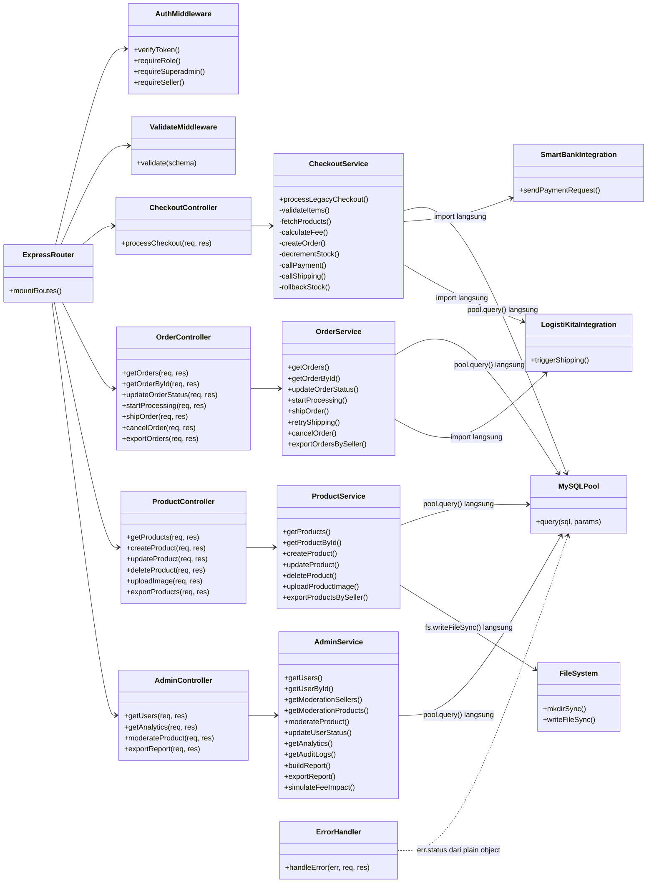
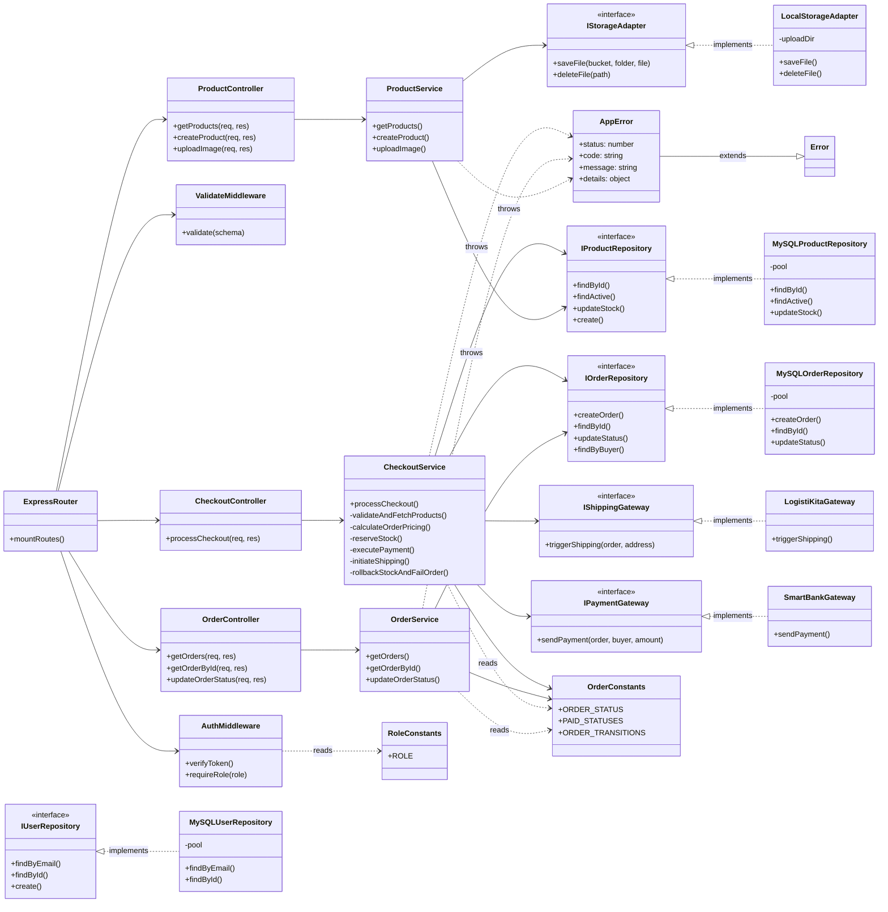

# Laporan Audit Refactoring Kode PasarKita

> Tanggal audit: 4 Juli 2026
> Auditor: Automated Deep Scan
> Commit basis: HEAD (post MySQL migration)
> Cakupan: 66 file backend `.js` (3.460 baris), 17 file frontend `.tsx/.ts` (5.035 baris)

---

## Daftar Isi

1. [Identitas dan Deskripsi Aplikasi](#1-identitas-dan-deskripsi-aplikasi)
2. [Struktur Folder dan Arsitektur](#2-struktur-folder-dan-arsitektur)
3. [Temuan Masalah Kode](#3-temuan-masalah-kode)
4. [Analisis Before-After Refactoring](#4-analisis-before-after-refactoring)
5. [Class Diagram Sebelum dan Sesudah](#5-class-diagram-sebelum-dan-sesudah)
6. [Analisis Prinsip Desain](#6-analisis-prinsip-desain)

---

## 1. Identitas dan Deskripsi Aplikasi

| Atribut | Nilai |
|---------|-------|
| Nama Aplikasi | PasarKita |
| Jenis | Marketplace Digital UMKM (B2C) |
| Mata Kuliah | Rekayasa Perangkat Lunak 2 |
| Dosen | M. Yusril Helmi Setyawan, S.Kom., M.Kom. |
| Kelompok | 2 |
| Anggota | Raditya Rizki Raharja (714240041), Ridwan Hakim Ramadhan, Muhammad Rashid Al Savero |
| Repository | pasarkita-monorepo |

### Deskripsi Singkat

PasarKita adalah platform marketplace digital untuk produk UMKM Indonesia. Aplikasi bertindak sebagai Demand Generator (B2C) dan terintegrasi dengan SmartBank (pembayaran) dan LogistiKita (pengiriman) melalui API Gateway dalam ekosistem microservices antar kelompok. Pengguna terdiri dari Buyer (pembeli), Seller (penjual), dan Superadmin.

### Tech Stack

| Layer | Teknologi |
|-------|-----------|
| Frontend | Next.js 16.2, React 19.2, TypeScript, Tailwind CSS v4, shadcn/Base UI |
| State Management | Zustand (auth, cart), TanStack Query (server state) |
| Backend | Express.js 5.2, serverless-http, CommonJS |
| Database | MySQL/MariaDB (mysql2/promise) |
| Auth | JWT (jsonwebtoken, bcrypt) |
| Validasi | Zod, React Hook Form |
| Storage | Local filesystem (express.static) |
| Deploy | Vercel (frontend + backend, project terpisah) |

---

## 2. Struktur Folder dan Arsitektur

### 2.1 Struktur Folder Aktual

```
pasarkita-monorepo/
+-- frontend/                   # Next.js 16.2 App Router
|   +-- app/                    # Route groups: (main), (admin), (seller), auth
|   +-- components/pk/          # 17 komponen UI custom PasarKita
|   +-- lib/api/                # 13 modul API wrapper per domain
|   +-- lib/api.ts              # Axios instance dengan interceptor
|   +-- store/                  # Zustand stores (auth, cart)
|   +-- types/api.ts            # 779 baris tipe TypeScript (monolith)
|   +-- proxy.ts                # Edge middleware UX route guard
|
+-- backend/
|   +-- api/index.js            # Entry point serverless Vercel
|   +-- src/
|   |   +-- config/             # env.js, mysql.js
|   |   +-- integrations/       # smartbank.js, logistikita.js, target.js
|   |   +-- middlewares/        # auth.js, validate.js, errorHandler.js
|   |   +-- modules/            # 15 modul fitur (feature-based)
|   |   |   +-- admin/          # service (454 baris), controller, routes, schema
|   |   |   +-- checkout/       # service (89 baris), controller, routes, schema
|   |   |   +-- orders/         # service (420 baris), controller, routes, schema
|   |   |   +-- products/       # service (392 baris), controller, routes, schema
|   |   |   +-- auth/           # service (123 baris), controller, routes, schema
|   |   |   +-- seller/         # service (198 baris), controller, routes, schema
|   |   |   +-- ratings/        # service (197 baris), controller, routes
|   |   |   +-- promotions/     # service (293 baris), controller, routes, schema
|   |   |   +-- ads/            # service (243 baris), controller, routes, schema
|   |   |   +-- chats/          # service (204 baris), controller, routes, schema
|   |   |   +-- complaints/     # service (160 baris), controller, routes, schema
|   |   |   +-- notifications/  # service (106 baris), controller, routes
|   |   |   +-- profile/        # service (117 baris), controller, routes, schema
|   |   |   +-- fee/            # controller (42 baris), routes
|   |   |   +-- smartbank/      # routes (32 baris, inline handler)
|   |   +-- utils/              # response.js, fee.js, kmp-search.js, observability.js
|   +-- database/               # Schema SQL, migrations, scripts
|   +-- uploads/                # Filesystem storage (product-images, store-assets, review-images)
|
+-- mock/                       # Mock server lokal (SmartBank :4001, LogistiKita :4002)
```

### 2.2 Pola Arsitektur

Backend menerapkan pola **Routes -> Controller -> Service** secara konsisten pada 14 dari 15 modul. Satu pengecualian: modul `smartbank` meletakkan business logic langsung di file routes.

Alur eksekusi request:

```
HTTP Request
  -> Express Router (routes.js)
    -> Middleware (auth, validate)
      -> Controller (menerima req/res, delegasi ke service)
        -> Service (business logic + akses database langsung)
          -> MySQL pool (pool.query)
```

Masalah arsitektur utama: **tidak ada layer Repository/DAO** antara Service dan Database. Seluruh 15 file service melakukan `require('../../config/mysql')` dan menjalankan SQL langsung di dalam logika bisnis.

---

## 3. Temuan Masalah Kode

### 3.1 Ringkasan Temuan

| No | Kategori Masalah | Jumlah Lokasi | Severity | Prinsip Dilanggar |
|----|-----------------|---------------|----------|-------------------|
| T1 | God Method (fungsi > 50 baris) | 8 fungsi backend, 6 komponen frontend | Tinggi | SRP |
| T2 | Direct DB Coupling (pool.query di service) | 15 service files, 100+ query calls | Tinggi | DIP |
| T3 | Throw Plain Object (bukan Error class) | 80+ lokasi backend | Tinggi | Clean Code |
| T4 | Duplikasi Kode Lintas File | 8 cluster duplikasi backend, 7 cluster frontend | Tinggi | DRY, SRP |
| T5 | Magic Strings (status, role hardcoded) | Seluruh codebase | Sedang | OCP |
| T6 | Inline require() di dalam fungsi | 20+ lokasi | Sedang | Clean Code |
| T7 | Filesystem I/O langsung di service | 3 file service (product, seller, rating) | Sedang | DIP, SRP |
| T8 | Inkonsistensi error format | complaint.service.js tanpa field `code` | Sedang | Clean Code |
| T9 | Frontend mixed concerns (fetch+mutate+render) | 6 page components | Sedang | SRP |
| T10 | Tipe frontend monolith | types/api.ts (779 baris) | Rendah | ISP |

### 3.2 Detail Temuan Backend

#### T1. God Method -- Fungsi Terlalu Besar

| File | Fungsi | Baris | Tanggung Jawab Tercampur |
|------|--------|------:|--------------------------|
| admin.service.js | getAnalytics | 140 | 6 DB query, agregasi, time series, health score, action center |
| order.service.js | getOrders | 105 | Pagination, role filter, admin search, date filter, SQL builder, item fetch, mapping |
| product.service.js | getProducts | 101 | Filter, pagination, search KMP, sort rating/sold, extra queries, in-memory ranking |
| checkout.service.js | processLegacyCheckout | 74 | Validasi, stock check, fee, insert order, insert items, update stock, payment, shipping, rollback |
| seller.service.js | getSellerAnalytics | 88 | Product query, order items, ratings, aggregation, bucketing, statistics |
| product.service.js | getPublicStore | 77 | Seller query, profile query, product count, rating, sales, tracking coverage |
| order.service.js | getOrderById | 72 | Order fetch, item mapping, access control, status history, vouchers, audit logs |
| promotion.service.js | quotePromotions | 63 | Item building, marketplace voucher, seller voucher, fee calculation |

Contoh terburuk -- `admin.service.js:getAnalytics` L213-L353:

```javascript
// 140 baris dalam satu fungsi
const getAnalytics = async (query) => {
  const period = parsePeriod(query);
  // Query 1: Semua order dalam rentang
  // Query 2: Semua user baru
  // Query 3: Semua produk (FULL TABLE SCAN tanpa WHERE)
  // Query 4: Semua order items (FULL TABLE SCAN tanpa WHERE)
  // Query 5: Semua seller
  // Query 6: Semua rating
  // ... 100+ baris agregasi in-memory ...
  // ... time series bucketing ...
  // ... health score calculation ...
  // ... action center ...
};
```

#### T2. Direct Database Coupling (DIP Violation)

Seluruh 15 service file melakukan import langsung ke MySQL pool:

```javascript
// Baris 1 di SETIAP service file:
const pool = require('../../config/mysql');
```

Service yang teridentifikasi:

| File | Jumlah pool.query() |
|------|--------------------:|
| admin.service.js | 18 |
| order.service.js | 15 |
| product.service.js | 14 |
| promotion.service.js | 12 |
| ads.service.js | 11 |
| seller.service.js | 8 |
| chat.service.js | 8 |
| rating.service.js | 7 |
| complaint.service.js | 6 |
| auth.service.js | 6 |
| notification.service.js | 5 |
| profile.service.js | 5 |
| checkout.service.js | 8 |

Dampak: Unit testing tidak mungkin tanpa koneksi database aktif. Mengganti database engine memerlukan perubahan di 15+ file.

#### T3. Throw Plain Object (Error Handling Systemik)

Seluruh codebase backend menggunakan pola:

```javascript
throw { status: 400, code: 'VALIDATION_ERROR', message: 'Items tidak boleh kosong' };
```

alih-alih Error class yang proper. Ditemukan 80+ lokasi throw plain object. Akibatnya:
- Stack trace hilang pada semua error path
- Tidak bisa membedakan operational error dan programming bug
- `errorHandler.js` bergantung pada properti plain object (`err.status`, `err.code`)

Lebih buruk, `complaint.service.js` menggunakan format yang BERBEDA dari seluruh codebase -- throw object tanpa field `code`:

```javascript
// complaint.service.js -- INKONSISTEN
throw { status: 404, message: 'Pesanan tidak ditemukan' };
// vs seluruh file lain:
throw { status: 404, code: 'NOT_FOUND', message: 'Pesanan tidak ditemukan' };
```

#### T4. Duplikasi Kode Lintas File

**Cluster duplikasi backend:**

| # | Kode Terduplikasi | File Lokasi | Jumlah Duplikasi |
|---|-------------------|-------------|:----------------:|
| 1 | IMAGE_EXTENSIONS (map mimetype ke extension) | product.service L7, seller.service L7, rating.service L5 | 3x |
| 2 | Upload image boilerplate (fs.mkdirSync + writeFileSync) | product.service L36-41, seller.service L165-170, rating.service L13-18 | 3x |
| 3 | parsePositiveInt helper | order.service L18, admin.service L11 | 2x |
| 4 | startOfJakartaDay helper | admin.service L19, seller.service L9 | 2x |
| 5 | bucketKey helper | admin.service L43, seller.service L15 | 2x |
| 6 | parsePeriod helper | admin.service L25, seller.service L21 | 2x |
| 7 | escapeCSV function | order.service L405, product.service L368 | 2x |
| 8 | Dynamic field update pattern (Object.entries loop) | product L321, seller L144, profile L13+L64, promotion L225+L247+L275, ads L218 | 9x |

**Cluster duplikasi frontend:**

| # | Kode Terduplikasi | File Lokasi | Jumlah Duplikasi |
|---|-------------------|-------------|:----------------:|
| 1 | Row component (label/value display) | checkout/page L28, orders/[id]/page L112, products/[id]/page L515 | 3x |
| 2 | Pagination footer UI | seller/orders L512, seller/products L324, admin/orders L219, admin/users L263 | 4x |
| 3 | Search input with icon | seller/orders L309, seller/products L174, admin/orders L158, admin/users L113 | 4x |
| 4 | CSV export blob download | seller/orders L210, seller/products L124 | 2x |
| 5 | Status tabs UI | orders/page L57, seller/orders L276, admin/orders L140 | 3x |
| 6 | resetFilters function | seller/orders L185, seller/products L107, admin/orders L107, admin/users L94 | 4x |
| 7 | Fee rate magic number 0.02 | checkout/page L230, products/[id]/page L93 | 2x |

#### T5. Magic Strings dan Magic Numbers

Status order tersebar sebagai string literal:

```javascript
// Muncul di 10+ file:
'pending', 'paid', 'processing', 'shipped', 'delivered', 'payment_failed', 'cancelled'

// Role string di 8+ file:
'buyer', 'seller', 'superadmin'

// Notification type INKONSISTEN (lowercase vs UPPERCASE):
'order', 'system'                           // notification.service.js
'COMPLAINT_NEW', 'COMPLAINT_REPLIED'        // notification.service.js (beda file, beda konvensi)
```

Magic numbers:

```javascript
5000    // LIMIT query (admin, product, order -- hardcoded)
0.02    // fee percentage (fee.js, checkout/page.tsx, products/[id]/page.tsx)
86400   // cookie max-age di auth store (24 jam)
8000    // timeout HTTP call ke SmartBank/LogistiKita
10      // connectionLimit pool MySQL
```

#### T7. Filesystem I/O Langsung di Service

Tiga file service melakukan operasi filesystem sinkron langsung:

```javascript
// product.service.js L36-41, seller.service.js L165-170, rating.service.js L13-18
// POLA IDENTIK:
const fs = require('fs');        // inline require
const pathMod = require('path'); // inline require
fs.mkdirSync(uploadDir, { recursive: true });   // blocking I/O
fs.writeFileSync(path.join(uploadDir, fileName), file.buffer); // blocking I/O
```

Dampak: Service terikat kuat pada filesystem lokal. Migrasi ke cloud storage (S3, GCS) memerlukan perubahan di 3 file service. Operasi sinkron memblokir event loop Node.js.

### 3.3 Detail Temuan Frontend

#### T9. Mixed Concerns di Page Components

| Page Component | Baris | Data Queries | Mutations | Handlers | Render |
|----------------|------:|:------------:|:---------:|:--------:|:------:|
| seller/orders/page.tsx | 554 | 2 | 3 | 3 | Ya |
| products/[id]/page.tsx | 550 | 2 | 0 | 4 | Ya |
| profile/page.tsx | 565 | 1 | 0 | 2 | Ya |
| checkout/page.tsx | 503 | 4 | 1 | 1 | Ya |
| orders/[id]/page.tsx | 500 | 2 | 0 | 3 | Ya |
| seller-product-form.tsx | 663 | 0 | 1 | 2 | Ya |

Setiap komponen mencampur: data fetching (useQuery), mutation (useMutation), event handlers, state management (useState), dan rendering JSX dalam satu fungsi.

#### T10. Tipe Monolith

File `types/api.ts` berisi 779 baris yang mencampur tipe untuk semua domain: user, product, order, rating, complaint, analytics, report, admin, seller, chat, notification, promotion, ads. Melanggar Interface Segregation Principle.

---

## 4. Analisis Before-After Refactoring

### 4.1 Refactoring R1: Extract Repository Layer (DIP)

**Masalah:** Service langsung memanggil `pool.query()` -- 100+ lokasi.

**Before** (`auth.service.js`):
```javascript
const pool = require('../../config/mysql');

const login = async (payload) => {
  const [rows] = await pool.query('SELECT * FROM users WHERE email = ?', [payload.email]);
  const user = rows[0];
  if (!user) throw { status: 401, code: 'UNAUTHORIZED', message: 'Email atau password salah' };
  // ... logika bisnis ...
};
```

**After** (Repository Pattern):
```javascript
// src/repositories/user.repository.js
const pool = require('../config/mysql');

const findByEmail = async (email) => {
  const [rows] = await pool.query('SELECT * FROM users WHERE email = ?', [email]);
  return rows[0] || null;
};

module.exports = { findByEmail };

// src/modules/auth/auth.service.js
const userRepository = require('../../repositories/user.repository');

const login = async (payload) => {
  const user = await userRepository.findByEmail(payload.email);
  if (!user) throw { status: 401, code: 'UNAUTHORIZED', message: 'Email atau password salah' };
  // ... logika bisnis murni ...
};
```

**Manfaat:** Service tidak lagi bergantung pada detail SQL. Unit test bisa mock repository. Penggantian database hanya mengubah file repository.

### 4.2 Refactoring R2: Extract God Method (SRP)

**Masalah:** `processLegacyCheckout` (74 baris) menangani 7 tanggung jawab.

**Before** (`checkout.service.js`):
```javascript
const processLegacyCheckout = async (buyerId, payload) => {
  // Validasi manual (L10-L11)
  // Query produk dari DB (L13-L17)
  // Cek stok per item (L19-L23)
  // Hitung subtotal dan fee (L25-L26)
  // Insert order ke DB (L28-L32)
  // Insert order items ke DB (L34-L41)
  // Update stok per item -- loop N+1 (L43-L51)
  // Panggil SmartBank payment (L53-L56)
  // Update order status (L57)
  // Panggil LogistiKita shipping (L60-L70)
  // Handle payment failure + rollback stok (L73-L81)
};
```

**After** (Extract Method):
```javascript
// checkout.service.js -- orchestration only
const processCheckout = async (buyerId, payload) => {
  const products = await validateAndFetchProducts(payload.items);
  const pricing = calculateOrderPricing(products, payload.items);
  const order = await createOrderWithItems(buyerId, pricing, payload.shipping_address);
  await reserveStock(payload.items, products);

  try {
    const payment = await executePayment(order, buyerId, pricing);
    await markOrderPaid(order.id, payment.transaction_id);
    const shipping = await initiateShipping(order, payload);
    return buildCheckoutResponse(order, pricing, payment, shipping);
  } catch (paymentErr) {
    await rollbackStockAndFailOrder(order.id, payload.items, products);
    throw paymentErr;
  }
};

// Setiap fungsi: satu tanggung jawab, mudah diuji secara independen
```

### 4.3 Refactoring R3: Error Class (Clean Code)

**Masalah:** 80+ lokasi throw plain object tanpa stack trace.

**Before:**
```javascript
throw { status: 400, code: 'VALIDATION_ERROR', message: 'Items tidak boleh kosong' };
throw { status: 404, message: 'Pesanan tidak ditemukan' }; // inkonsisten: tanpa code
```

**After:**
```javascript
// src/utils/app-error.js
class AppError extends Error {
  constructor(status, code, message, details = null) {
    super(message);
    this.name = 'AppError';
    this.status = status;
    this.code = code;
    this.details = details;
  }
}

module.exports = { AppError };

// Pemakaian di service:
const { AppError } = require('../../utils/app-error');
throw new AppError(400, 'VALIDATION_ERROR', 'Items tidak boleh kosong');
throw new AppError(404, 'NOT_FOUND', 'Pesanan tidak ditemukan');
```

**Manfaat:** Stack trace tersedia di semua error. Format konsisten (selalu ada `code`). `errorHandler.js` bisa membedakan AppError vs programming bug.

### 4.4 Refactoring R4: Extract Shared Utilities (DRY)

**Masalah:** 8 cluster duplikasi backend, 7 cluster duplikasi frontend.

**Before** (3 file identik):
```javascript
// product.service.js, seller.service.js, rating.service.js
const IMAGE_EXTENSIONS = { 'image/jpeg': 'jpg', 'image/png': 'png', 'image/webp': 'webp' };

const uploadImage = async (userId, file) => {
  const fs = require('fs');
  const pathMod = require('path');
  const fileName = `${randomUUID()}.${extension}`;
  const uploadDir = pathMod.join(__dirname, '../../../uploads', BUCKET, userId);
  fs.mkdirSync(uploadDir, { recursive: true });
  fs.writeFileSync(pathMod.join(uploadDir, fileName), file.buffer);
};
```

**After:**
```javascript
// src/utils/storage.js
const fs = require('fs');
const path = require('path');
const { randomUUID } = require('crypto');

const IMAGE_EXTENSIONS = { 'image/jpeg': 'jpg', 'image/png': 'png', 'image/webp': 'webp' };

const saveUploadedFile = async (bucket, subFolder, file) => {
  const extension = IMAGE_EXTENSIONS[file.mimetype];
  if (!extension) throw new AppError(400, 'INVALID_IMAGE_TYPE', 'Format gambar harus JPG, PNG, atau WebP');
  const fileName = `${randomUUID()}.${extension}`;
  const uploadDir = path.join(__dirname, '../../uploads', bucket, subFolder);
  await fs.promises.mkdir(uploadDir, { recursive: true });
  await fs.promises.writeFile(path.join(uploadDir, fileName), file.buffer);
  return { image_url: `/uploads/${bucket}/${subFolder}/${fileName}`, path: `${subFolder}/${fileName}` };
};

module.exports = { IMAGE_EXTENSIONS, saveUploadedFile };
```

**Manfaat:** Satu sumber kebenaran. Migrasi ke cloud storage hanya mengubah satu file. Menggunakan `fs.promises` alih-alih operasi sinkron yang memblokir event loop.

### 4.5 Refactoring R5: Extract Constants (OCP)

**Masalah:** Status order dan role tersebar sebagai string literal di seluruh codebase.

**Before:**
```javascript
// Tersebar di 10+ file:
if (order.status !== 'paid') throw ...;
await pool.query("UPDATE orders SET status = 'processing' WHERE ...");
if (user.role === 'superadmin') { ... }
```

**After:**
```javascript
// src/constants/order.constants.js
const ORDER_STATUS = Object.freeze({
  PENDING: 'pending',
  PAID: 'paid',
  PROCESSING: 'processing',
  SHIPPED: 'shipped',
  DELIVERED: 'delivered',
  PAYMENT_FAILED: 'payment_failed',
  CANCELLED: 'cancelled',
});

const PAID_STATUSES = new Set([
  ORDER_STATUS.PAID, ORDER_STATUS.PROCESSING,
  ORDER_STATUS.SHIPPED, ORDER_STATUS.DELIVERED,
]);

module.exports = { ORDER_STATUS, PAID_STATUSES };

// src/constants/role.constants.js
const ROLE = Object.freeze({
  BUYER: 'buyer',
  SELLER: 'seller',
  SUPERADMIN: 'superadmin',
});

module.exports = { ROLE };

// Pemakaian:
const { ORDER_STATUS } = require('../../constants/order.constants');
if (order.status !== ORDER_STATUS.PAID) throw ...;
```

### 4.6 Refactoring R6: Frontend -- Extract Hooks dan Shared Components

**Masalah:** 6 page components >500 baris mencampur data, logic, dan rendering.

**Before** (`checkout/page.tsx`):
```tsx
export default function CheckoutContent() {
  // 4 useQuery calls (L155-180)
  // 8 useState calls (L135-150)
  // handlePay mutation (L239-297) -- 58 baris
  // 350+ baris JSX rendering
}
```

**After:**
```tsx
// hooks/useCheckout.ts
export function useCheckout(items) {
  const feeQuery = useQuery({ queryKey: ['fee'], queryFn: ... });
  const balanceQuery = useQuery({ queryKey: ['balance'], queryFn: ... });
  const payMutation = useMutation({ mutationFn: ... });
  return { feeQuery, balanceQuery, payMutation };
}

// components/pk/checkout-summary.tsx
export function CheckoutSummary({ subtotal, fee, total }) { ... }

// checkout/page.tsx -- orchestration only
export default function CheckoutContent() {
  const { feeQuery, balanceQuery, payMutation } = useCheckout(items);
  return (
    <CheckoutSummary ... />
    // ... komponen presentational kecil ...
  );
}
```

---

## 5. Class Diagram Sebelum dan Sesudah

### 5.1 Class Diagram SEBELUM Refactoring

Diagram ini menunjukkan coupling langsung antara service dan infrastruktur:



### 5.2 Class Diagram SESUDAH Refactoring

Diagram ini menunjukkan pemisahan lapisan dengan Repository pattern dan abstraksi Storage:



### 5.3 Perubahan Arsitektur Utama

| Aspek | Sebelum | Sesudah |
|-------|---------|---------|
| Akses Database | Service -> pool.query() langsung | Service -> Interface Repository -> MySQL Implementation |
| File Storage | Service -> fs.writeFileSync() langsung | Service -> Interface StorageAdapter -> Local Implementation |
| Integrasi Eksternal | Service -> import langsung | Service -> Interface Gateway -> SmartBank/LogistiKita Implementation |
| Error Handling | throw plain object { status, code, message } | throw new AppError(status, code, message) |
| Status/Role Constants | Magic strings tersebar | Satu file constants, di-import oleh seluruh consumer |
| Kode Duplikat | Copy-paste di 8 cluster (backend), 7 cluster (frontend) | Shared utilities dan shared components |

---

## 6. Analisis Prinsip Desain

### 6.1 Analisis SOLID

| Prinsip | Status Saat Ini | Temuan | Rekomendasi |
|---------|----------------|--------|-------------|
| **S** - Single Responsibility | Belum konsisten | 8 God Method di backend (admin: 454 baris, order: 420 baris). 6 God Component di frontend. admin.service.js menangani 8 domain berbeda. | Pecah service besar. Extract method. Extract hooks dan komponen presentational. |
| **O** - Open/Closed | Belum konsisten | Status order, role, sort options, notification types semua hardcoded sebagai string literal di 10+ file. Menambah status baru memerlukan perubahan di banyak file. | Extract ke constants/enum. Gunakan lookup tables alih-alih if-else chains. |
| **L** - Liskov Substitution | Tidak relevan | Codebase dominan functional (CommonJS backend, React hooks frontend). Hampir tidak ada inheritance. | N/A |
| **I** - Interface Segregation | Perlu perbaikan | types/api.ts (779 baris) mencampur 12+ domain berbeda. Perubahan tipe admin bisa mempengaruhi import di halaman buyer. | Pecah tipe per domain (user.ts, order.ts, product.ts, admin.ts, dll). |
| **D** - Dependency Inversion | Lemah | 15/15 service file langsung import MySQL pool. 3 service langsung import fs/path. checkout.service langsung import SmartBank dan LogistiKita. | Introduce repository/adapter pattern. Service bergantung pada abstraksi, bukan implementasi konkret. |

### 6.2 Analisis Clean Code

| Aspek | Status | Detail |
|-------|--------|--------|
| Small Functions | Gagal | 8 fungsi >50 baris, terbesar 140 baris. checkout.service.processLegacyCheckout memiliki 7 tanggung jawab tercampur. |
| Meaningful Names | Baik | Nama fungsi dan variabel umumnya deskriptif (getOrders, processCheckout, sendPaymentRequest). |
| DRY (Don't Repeat Yourself) | Gagal | 8 cluster duplikasi backend, 7 cluster duplikasi frontend. Upload image boilerplate copy-paste 3x. |
| Magic Values | Gagal | Status order, role, fee rate, query limits, timeout values hardcoded di seluruh codebase. |
| Error Handling | Gagal | 80+ lokasi throw plain object. Tidak ada Error class. complaint.service.js format inkonsisten. 3 lokasi frontend silent error swallowing. |
| Comments | Cukup | kmp-search.js memiliki dokumentasi algoritma yang baik. Sebagian besar file lain minim komentar namun cukup self-documenting. |
| Inline require | Gagal | 20+ inline require('crypto'), require('fs'), require('path') di dalam fungsi. Seharusnya di top-level. |
| Consistent Formatting | Cukup | Umumnya konsisten, beberapa baris sangat panjang (>200 karakter) di admin.service.js. |

### 6.3 High Cohesion dan Low Coupling

**Kondisi Saat Ini:**

- **Low Cohesion:** File admin.service.js (454 baris) menangani 8 domain berbeda (user CRUD, seller moderation, product moderation, analytics, audit logs, report, CSV export, fee simulation). checkout.service.js mencampur validasi, database operations, payment call, shipping call, dan stock management. Secara frontend, 6 page components mencampur data fetching, mutation, event handling, dan rendering.

- **High Coupling:** Seluruh 15 service files terikat langsung ke MySQL pool (tight coupling ke database engine). 3 service files terikat langsung ke filesystem Node.js (tight coupling ke storage). checkout.service langsung import notification service, promotion service, SmartBank integration, dan LogistiKita integration (coupling ke 4 modul lain).

**Target Sesudah Refactoring:**

- **High Cohesion:** Setiap service menangani satu domain. Repository menangani akses data. StorageAdapter menangani file I/O. Constants menangani definisi status/role. AppError menangani format error.

- **Low Coupling:** Service bergantung pada interface/abstraksi (repository, gateway, adapter), bukan implementasi konkret. Penggantian database, storage, atau payment provider hanya mengubah implementation class, bukan service layer.

### 6.4 Ponytail Audit -- Over-Engineering Scan

Selain temuan di atas yang berfokus pada under-engineering (kode terlalu monolith), berikut adalah temuan over-engineering yang bisa dipangkas:

| Tag | Temuan | Pengganti | Path |
|-----|--------|-----------|------|
| yagni | `processCheckout` wrapper hanya memanggil `processLegacyCheckout` -- indirection tanpa nilai | Hapus wrapper, rename legacy ke processCheckout | checkout.service.js L84-86 |
| shrink | `requireSuperadmin` dan `requireSeller` bisa diganti oleh `requireRole` yang sudah ada | Ganti semua pemakaian dengan `requireRole('superadmin')` dan `requireRole('seller')` | middlewares/auth.js L17-37 |
| delete | `scratch_test_db.js` masih import `@supabase/supabase-js` yang sudah dihapus dari package.json | Hapus file | backend/scratch_test_db.js |
| delete | `database/migrations/000-007` (PostgreSQL syntax) tidak bisa dijalankan di MySQL -- orphan files | Hapus atau pindah ke arsip | backend/database/migrations/*.sql |
| delete | `database/schema/000_full_schema.sql` (PostgreSQL) tidak bisa dijalankan di MySQL | Hapus atau pindah ke arsip | backend/database/schema/000_full_schema.sql |
| shrink | `recordView` dan `recordClick` di ads.service.js adalah copy-paste identik kecuali satu nama kolom | Gabung jadi satu fungsi `recordInteraction(type)` | ads.service.js L36-82 |
| shrink | 9 instance dynamic field update pattern bisa diganti satu utility | Buat `buildUpdateQuery(table, id, payload, allowedFields)` | 6 file service |

**Net removable:** ~200 baris backend, 1 dependency orphan (scratch file referencing @supabase/supabase-js).

---

## Lampiran

### A. Ukuran File Backend (Top 15)

| # | File | Baris |
|---|------|------:|
| 1 | admin.service.js | 454 |
| 2 | order.service.js | 420 |
| 3 | product.service.js | 392 |
| 4 | promotion.service.js | 293 |
| 5 | ads.service.js | 243 |
| 6 | chat.service.js | 204 |
| 7 | seller.service.js | 198 |
| 8 | rating.service.js | 197 |
| 9 | admin.controller.js | 159 |
| 10 | complaint.service.js | 160 |
| 11 | order.controller.js | 149 |
| 12 | ads.controller.js | 137 |
| 13 | seller.controller.js | 124 |
| 14 | auth.service.js | 123 |
| 15 | profile.service.js | 117 |

### B. Ukuran File Frontend (Top 10)

| # | File | Baris |
|---|------|------:|
| 1 | types/api.ts | 779 |
| 2 | components/pk/seller-product-form.tsx | 663 |
| 3 | components/pk/admin-analytics.tsx | 599 |
| 4 | app/(main)/profile/page.tsx | 565 |
| 5 | app/(seller)/seller/orders/page.tsx | 554 |
| 6 | app/(main)/products/[id]/page.tsx | 550 |
| 7 | app/(main)/checkout/page.tsx | 503 |
| 8 | app/(main)/orders/[id]/page.tsx | 500 |
| 9 | app/(seller)/seller/products/page.tsx | 351 |
| 10 | app/(admin)/admin/users/page.tsx | 276 |
