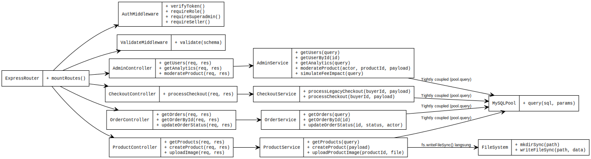
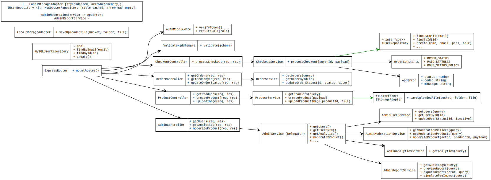
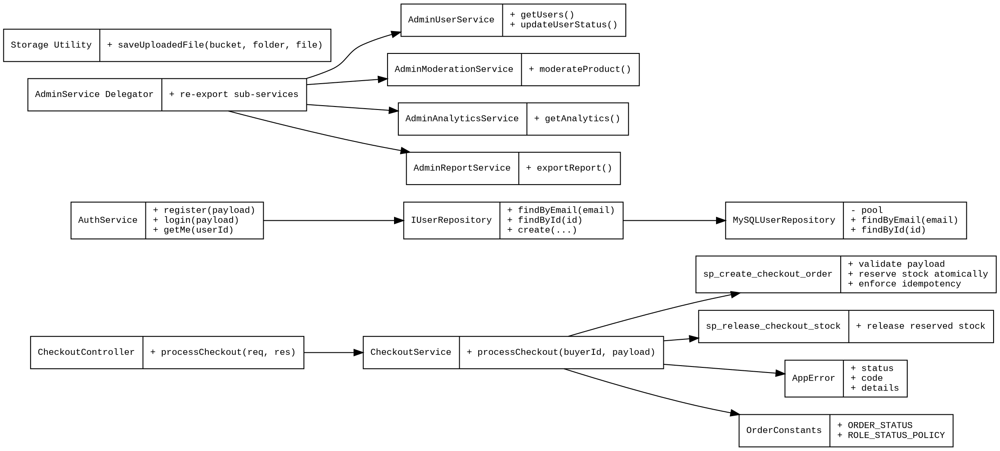

# LAPORAN ANALISIS DAN REFACTORING KODE APLIKASI PASARKITA

Mata Kuliah: Rekayasa Perangkat Lunak 2  
Pertemuan: P14  
Topik: MVC, SOLID, Clean Code, High Cohesion, Low Coupling, dan Refactoring

---

## 1. Identitas Proyek

| Atribut | Keterangan |
|---|---|
| Nama aplikasi | PasarKita |
| Jenis aplikasi | Marketplace digital produk UMKM (B2C) |
| Topik laporan | Analisis dan refactoring kode aplikasi web |
| Kelompok | 2 |
| Anggota | Raditya Rizki Raharja (714240041), Ridwan Hakim Ramadhan, Muhammad Rashid Al Savero |
| Repository | `pasarkita-monorepo` |
| Tanggal audit | 4 Juli 2026 |
| Basis analisis | Workspace lokal setelah migrasi database ke MySQL |

---

## 2. Deskripsi Singkat Aplikasi

PasarKita adalah aplikasi marketplace digital untuk memfasilitasi transaksi produk UMKM. Aplikasi memiliki tiga kelompok pengguna utama: pembeli, penjual, dan superadmin. Pembeli dapat melihat produk, checkout, memantau pesanan, memberi rating, chat, dan membuat komplain. Penjual dapat mengelola produk, promosi, iklan, profil toko, pesanan, chat, dan komplain. Superadmin dapat mengelola user, moderasi produk/seller, analytics, laporan, audit log, fee simulator, health center, dan action center.

Batasan analisis pada laporan ini adalah codebase lokal yang terdiri dari:

| Area | Teknologi |
|---|---|
| Frontend | Next.js 16.2, React 19.2, TypeScript, Tailwind CSS v4 |
| Backend | Express.js 5.2, CommonJS, `serverless-http` |
| Database | MySQL/MariaDB melalui `mysql2/promise` |
| Auth | JWT dan bcrypt |
| Validasi | Zod |
| Integrasi | SmartBank dan LogistiKita via backend |

Catatan penting: codebase saat ini sudah dimigrasikan ke MySQL. Dokumen lama yang masih menyebut Supabase/PostgreSQL dianggap artefak historis, bukan state runtime saat laporan ini dibuat.

---

## 3. Tujuan Refactoring

Refactoring dilakukan untuk memperbaiki kualitas internal kode tanpa mengubah tujuan fungsional aplikasi. Sasaran kualitas yang ingin dicapai:

1. Meningkatkan maintainability dengan memecah service/komponen besar.
2. Mengurangi coupling langsung antara business logic dan akses database.
3. Meningkatkan testability melalui repository dan unit test.
4. Menyeragamkan error handling menggunakan `AppError`.
5. Menghilangkan duplikasi helper dan upload file.
6. Mengamankan checkout dengan idempotency dan reservasi stok atomik.
7. Memecah tipe frontend agar lebih modular dan sesuai Interface Segregation Principle.

---

## 4. Ruang Lingkup Analisis Kode

Minimal lima modul yang dianalisis dan menjadi dasar laporan:

| No | Modul/File | Fokus Analisis |
|---|---|---|
| 1 | `backend/src/modules/checkout/checkout.service.js` | Checkout, payment, shipping, stok, idempotency |
| 2 | `backend/src/modules/auth/auth.service.js` | Repository pattern, error handling, testability |
| 3 | `backend/src/modules/admin/admin.service.js` | God service dan pemecahan sub-service |
| 4 | `backend/src/utils/response.js` | Bug data falsy pada response JSON |
| 5 | `backend/src/utils/storage.js` | Duplikasi upload file dan blocking filesystem I/O |
| 6 | `backend/src/modules/complaints/complaint.service.js` | Konsistensi `AppError` |
| 7 | `frontend/app/(main)/checkout/page.tsx` dan `frontend/hooks/useCheckout.ts` | Pemisahan logic checkout dari view |
| 8 | `frontend/types/api.ts` dan `frontend/types/*.ts` | Pemecahan tipe monolith |

---

## 5. Struktur Folder Aplikasi

Struktur aktual yang relevan:

```text
pasarkita-monorepo/
+-- backend/
|   +-- api/index.js
|   +-- src/
|   |   +-- app.js
|   |   +-- config/
|   |   |   +-- env.js
|   |   |   +-- mysql.js
|   |   +-- constants/
|   |   |   +-- index.js
|   |   +-- middlewares/
|   |   |   +-- auth.js
|   |   |   +-- validate.js
|   |   |   +-- errorHandler.js
|   |   +-- modules/
|   |   |   +-- admin/
|   |   |   +-- auth/
|   |   |   +-- checkout/
|   |   |   +-- orders/
|   |   |   +-- products/
|   |   |   +-- seller/
|   |   |   +-- complaints/
|   |   |   +-- ratings/
|   |   |   +-- promotions/
|   |   |   +-- ads/
|   |   +-- repositories/
|   |   |   +-- user.repository.js
|   |   +-- utils/
|   |       +-- app-error.js
|   |       +-- response.js
|   |       +-- shared.js
|   |       +-- storage.js
|   +-- database/schema/
|       +-- 000_mysql_full_schema.sql
|       +-- 001_mysql_stored_procedures.sql
|       +-- 002_mysql_triggers.sql
+-- frontend/
|   +-- app/
|   +-- components/
|   +-- hooks/
|   |   +-- useCheckout.ts
|   +-- lib/api/
|   +-- store/
|   +-- types/
|       +-- api.ts
|       +-- user.ts
|       +-- product.ts
|       +-- order.ts
|       +-- admin.ts
|       +-- seller.ts
+-- mock/
+-- docs/
```

---

## 6. Ringkasan Arsitektur MVC

PasarKita menggunakan pola MVC yang dipadukan dengan service layer:

```text
HTTP Request
  -> Express Router
  -> Middleware auth/validation
  -> Controller
  -> Service
  -> Repository atau MySQL pool/stored procedure
  -> Response helper
  -> Frontend view
```

Pemetaan layer:

| Layer | Implementasi di Repo | Contoh File |
|---|---|---|
| Route | Definisi endpoint Express | `backend/src/modules/products/product.routes.js` |
| Controller | Mengambil `req`, memanggil service, membentuk response | `backend/src/modules/checkout/checkout.controller.js` |
| Service | Business logic | `backend/src/modules/checkout/checkout.service.js` |
| Repository | Akses data yang mulai dipisahkan | `backend/src/repositories/user.repository.js` |
| Model/Database | Schema dan stored procedure MySQL | `backend/database/schema/*.sql` |
| View | Halaman dan komponen Next.js | `frontend/app/**/page.tsx` |
| Helper/Utility | Response, storage, shared helper | `backend/src/utils/*.js` |

---

## 7. Daftar Temuan Masalah Kode

| No | Temuan | Lokasi | Prinsip Terkait | Dampak Negatif | Status Refactoring |
|---|---|---|---|---|---|
| T1 | Response sukses membuang data falsy jika memakai `if (data)` | `backend/src/utils/response.js` | Clean Code | Nilai `0`, `false`, atau string kosong bisa hilang dari payload | Selesai |
| T2 | `admin.service.js` terlalu besar dan memegang banyak tanggung jawab | `backend/src/modules/admin/admin.service.js` | SRP, High Cohesion | Sulit dirawat dan rawan konflik perubahan | Selesai |
| T3 | Auth service bergantung langsung pada query SQL | `backend/src/modules/auth/auth.service.js` | DIP, Testability | Unit test butuh DB aktif dan business logic sulit diisolasi | Selesai untuk modul auth |
| T4 | Checkout lama melakukan validasi, create order, stok, payment, shipping, rollback dalam satu fungsi | `backend/src/modules/checkout/checkout.service.js` | SRP, Low Coupling | Race condition stok, idempotency tidak efektif, fungsi sulit diuji | Selesai untuk alur utama |
| T5 | Plain object error tanpa `code` konsisten | `backend/src/modules/complaints/complaint.service.js` | Clean Code | Stack trace lemah dan response error tidak seragam | Selesai untuk complaint |
| T6 | Upload gambar duplikatif dan sebelumnya sinkron | `product/seller/rating service` | DRY, DIP | Copy-paste dan blocking I/O | Selesai |
| T7 | Tipe frontend monolith | `frontend/types/api.ts` | ISP | Satu file terlalu banyak domain | Selesai |
| T8 | Checkout page mencampur fetching, state, mutation, dan rendering | `frontend/app/(main)/checkout/page.tsx` | SRP, Separation of Concerns | File tebal dan sulit dirawat | Selesai sebagian besar |
| T9 | Query database masih tersebar pada banyak service | `backend/src/modules/*/*.service.js` | DIP | Refactor repository belum menyeluruh | Parsial |

---

## 8. Analisis Before-After Refactoring

### Temuan 1: Response Helper Membuang Data Falsy

Masalah: response sukses lama berpotensi hanya menyertakan `data` jika nilainya truthy.

Before:

```js
const response = { success: true };
if (data) response.data = data;
```

After:

```js
const response = { success: true };
if (data !== undefined) response.data = data;
```

Lokasi implementasi: `backend/src/utils/response.js`.

Dampak: API tetap dapat mengirim data valid seperti `0`, `false`, dan array kosong.

---

### Temuan 2: God Service pada Admin

Masalah: `admin.service.js` sebelumnya memegang user management, moderation, analytics, report, audit log, dan fee simulation dalam satu file.

Before:

```js
// admin.service.js
const getUsers = async (...) => { ... };
const getModerationProducts = async (...) => { ... };
const getAnalytics = async (...) => { ... };
const exportReport = async (...) => { ... };
module.exports = { getUsers, getModerationProducts, getAnalytics, exportReport };
```

After:

```js
const { getUsers, getUserById, updateUserStatus } = require('./admin-user.service');
const { getModerationSellers, getModerationProducts, moderateProduct } = require('./admin-moderation.service');
const { getAnalytics } = require('./admin-analytics.service');
const { getAuditLogs, previewReport, exportReport, simulateFeeImpact } = require('./admin-report.service');
```

Lokasi implementasi: `backend/src/modules/admin/admin.service.js`.

Dampak: file utama menjadi delegator, sedangkan domain admin dipisah menjadi service yang lebih kohesif.

---

### Temuan 3: Auth Service Coupled ke SQL

Masalah: service auth semula menjalankan query langsung, sehingga sulit dibuat unit test tanpa database.

Before:

```js
const [rows] = await pool.query('SELECT * FROM users WHERE email = ?', [email]);
const user = rows[0];
```

After:

```js
const userRepository = require('../../repositories/user.repository');
const user = await userRepository.findByEmail(email);
```

Repository:

```js
const findByEmail = async (email) => {
  const [rows] = await pool.query('SELECT * FROM users WHERE email = ?', [email]);
  return rows[0] || null;
};
```

Lokasi implementasi: `backend/src/modules/auth/auth.service.js` dan `backend/src/repositories/user.repository.js`.

Dampak: unit test `auth.test.js` dapat melakukan mock repository, bukan koneksi database.

---

### Temuan 4: Checkout Monolith dan Tidak Memakai Stored Procedure Idempotent

Masalah: service checkout lama membuat order, insert item, mengurangi stok, payment, shipping, dan rollback manual dalam satu fungsi. Padahal schema MySQL sudah menyediakan `sp_create_checkout_order` untuk idempotency dan reservasi stok atomik.

Before:

```js
await pool.query('INSERT INTO orders (...) VALUES (...)');
await pool.query('INSERT INTO order_items (...) VALUES ...');
await pool.query('UPDATE products SET stock = ? WHERE id = ?');
const paymentResult = await sendPaymentRequest(...);
```

After:

```js
const [rows] = await pool.query(
  'CALL sp_create_checkout_order(?, ?, ?, ?)',
  [buyerId, payload.idempotency_key, payload.shipping_address.trim(), JSON.stringify(payload.items)]
);
```

Checkout service sekarang dipisah menjadi helper:

```js
validateCheckoutPayload(payload);
const { orderId, created } = await createCheckoutOrder(buyerId, payload);
let order = await getCheckoutOrder(orderId);
const orderItems = await getCheckoutOrderItems(orderId);
```

Lokasi implementasi: `backend/src/modules/checkout/checkout.service.js`.

Dampak: pembuatan order dan reservasi stok menjadi atomik, idempotency key dipakai, dan rollback stok memakai `sp_release_checkout_stock`.

---

### Temuan 5: Plain Object Error pada Complaint

Masalah: `complaint.service.js` sebelumnya melempar object tanpa `code`.

Before:

```js
if (!order) throw { status: 404, message: 'Pesanan tidak ditemukan' };
```

After:

```js
if (!order) throw new AppError(404, 'NOT_FOUND', 'Pesanan tidak ditemukan');
```

Lokasi implementasi: `backend/src/modules/complaints/complaint.service.js`.

Dampak: response error lebih konsisten dan stack trace tetap mengikuti kelas `Error`.

---

### Temuan 6: Duplikasi Upload File

Masalah: upload image pernah tersebar pada produk, seller, dan rating dengan pola `fs.mkdirSync` dan `fs.writeFileSync`.

Before:

```js
fs.mkdirSync(uploadDir, { recursive: true });
fs.writeFileSync(path.join(uploadDir, fileName), file.buffer);
```

After:

```js
const fs = require('fs/promises');
await fs.mkdir(uploadDir, { recursive: true });
await fs.writeFile(path.join(uploadDir, fileName), file.buffer);
```

Lokasi implementasi: `backend/src/utils/storage.js`.

Dampak: satu helper upload dipakai oleh product, seller, dan rating. I/O juga menjadi non-blocking.

---

### Temuan 7: Frontend Checkout Page Terlalu Gemuk

Masalah: halaman checkout mencampur query produk, saldo SmartBank, budget mingguan, quote promo, idempotency key, mutation checkout, toast, redirect, dan JSX.

Before:

```tsx
function CheckoutContent() {
  const productQuery = useQuery(...);
  const balanceQuery = useQuery(...);
  const quoteQuery = useQuery(...);
  const handlePay = async () => { ... };
  return <div>...</div>;
}
```

After:

```tsx
const {
  productQuery,
  balance,
  quote,
  total,
  handlePay,
} = useCheckout();
```

Lokasi implementasi: `frontend/hooks/useCheckout.ts` dan `frontend/app/(main)/checkout/page.tsx`.

Dampak: halaman lebih fokus pada render, sedangkan logic checkout terpusat dalam custom hook.

---

### Temuan 8: Tipe Frontend Monolith

Masalah: `frontend/types/api.ts` sebelumnya menjadi file besar yang mencampur domain user, product, order, seller, admin, voucher, notification, dan ads.

Before:

```ts
// api.ts berisi seluruh tipe lintas domain
export type User = ...
export type Product = ...
export type Order = ...
```

After:

```ts
export * from './common';
export * from './user';
export * from './product';
export * from './order';
export * from './voucher';
export * from './complaint';
export * from './rating';
export * from './notification';
export * from './admin';
export * from './seller';
export * from './ads';
```

Lokasi implementasi: `frontend/types/api.ts` dan `frontend/types/*.ts`.

Dampak: import lama tetap kompatibel, tetapi definisi tipe sudah dipisahkan per domain.

---

## 9. Class Diagram Sebelum Refactoring

Gambar hasil render:



File DOT: `docs/refactoring/class_diagram_sebelum.dot`

Kode DOT:

```dot
digraph ClassDiagramSebelum {
    rankdir=LR;
    node [shape=record, fontname="Courier New", fontsize=10];
    edge [arrowhead=vee, fontname="Arial", fontsize=9];

    ExpressRouter [label="{ExpressRouter|+ mountRoutes()\l}"];
    CheckoutController [label="{CheckoutController|+ processCheckout(req, res)\l}"];
    ProductController [label="{ProductController|+ getProducts(req, res)\l+ createProduct(req, res)\l+ uploadImage(req, res)\l}"];
    AdminController [label="{AdminController|+ getUsers(req, res)\l+ getAnalytics(req, res)\l+ moderateProduct(req, res)\l}"];

    CheckoutService [label="{CheckoutService|+ processLegacyCheckout(buyerId, payload)\l+ processCheckout(buyerId, payload)\l}"];
    ProductService [label="{ProductService|+ getProducts(query)\l+ createProduct(payload)\l+ uploadProductImage(productId, file)\l}"];
    AdminService [label="{AdminService|+ getUsers(query)\l+ getAnalytics(query)\l+ moderateProduct(...)\l}"];

    MySQLPool [label="{MySQLPool|+ query(sql, params)\l}"];
    FileSystem [label="{FileSystem|+ mkdirSync(path)\l+ writeFileSync(path, data)\l}"];

    ExpressRouter -> CheckoutController;
    ExpressRouter -> ProductController;
    ExpressRouter -> AdminController;
    CheckoutController -> CheckoutService;
    ProductController -> ProductService;
    AdminController -> AdminService;
    CheckoutService -> MySQLPool [label="pool.query langsung"];
    ProductService -> MySQLPool [label="pool.query langsung"];
    AdminService -> MySQLPool [label="pool.query langsung"];
    ProductService -> FileSystem [label="fs.writeFileSync langsung"];
}
```



---

## 10. Class Diagram Sesudah Refactoring

Gambar hasil render:



File DOT: `docs/refactoring/class_diagram_sesudah.dot`

Kode DOT ringkas:



Catatan: file SVG sudah tersedia di folder `docs/refactoring`. Pada sesi ini executable Graphviz `dot` tidak tersedia di environment, sehingga render ulang SVG tidak dijalankan. File DOT tetap disimpan sebagai lampiran utama sesuai ketentuan tugas.

---

## 11. Analisis SOLID

| Prinsip | Analisis Berdasarkan Kode | Status |
|---|---|---|
| SRP | Admin service dipecah menjadi user, moderation, analytics, dan report service. Checkout service juga dipisah menjadi helper validasi, create order, payment, shipping, dan rollback. | Baik |
| OCP | Status order dan role dipusatkan di `backend/src/constants/index.js`, sehingga aturan status lebih mudah diubah tanpa menyebar string literal baru. | Baik |
| LSP | Codebase tidak banyak memakai inheritance. `AppError` mewarisi `Error` dan tetap dapat diproses oleh Express error middleware. | Cukup |
| ISP | Tipe frontend dipisah menjadi file domain kecil (`user.ts`, `order.ts`, `product.ts`, dan lainnya), sementara `api.ts` menjadi re-export compatibility layer. | Baik |
| DIP | Auth sudah bergantung pada repository. Namun banyak service lain masih langsung memakai `pool.query`, sehingga DIP belum menyeluruh. | Parsial |

Kesimpulan SOLID: refactoring sudah memperbaiki SRP, ISP, dan sebagian DIP. Area lanjutan yang paling besar adalah membuat repository untuk order, product, promotion, ads, complaint, dan checkout.

---

## 12. Analisis Clean Code

| Aspek | Kondisi Setelah Refactoring |
|---|---|
| Naming | Nama fungsi cukup deskriptif: `createCheckoutOrder`, `failOrderAndReleaseStock`, `saveUploadedFile`, `getModerationProducts`. |
| Small Functions | Checkout tidak lagi satu alur panjang. Namun beberapa service lain masih besar, seperti `orders/order.service.js` dan `products/product.service.js`. |
| Duplication | Duplikasi upload file sudah dipusatkan di `storage.js`; helper parsing dan CSV ada di `shared.js`. |
| Magic Value | Sebagian status dipusatkan pada constants, tetapi beberapa string status dan angka limit masih tersebar. |
| Error Handling | `AppError` sudah digunakan pada auth, checkout, complaint, dan sebagian order/admin. Masih ada plain object error pada beberapa service lama. |
| Separation of Concerns | Checkout frontend sudah dipisah ke `useCheckout`; admin backend sudah dipisah menjadi sub-service. |

---

## 13. High Cohesion dan Low Coupling

Sebelum refactoring:

| Area | Masalah |
|---|---|
| Admin service | Banyak domain bercampur dalam satu file. |
| Checkout service | Validasi, order, stok, payment, shipping, dan rollback bercampur. |
| Auth service | Business logic bercampur dengan SQL langsung. |
| Upload image | Product, seller, dan rating menyimpan file dengan pola duplikatif. |
| Checkout page | View bercampur dengan fetching dan mutation. |

Sesudah refactoring:

| Area | Perbaikan |
|---|---|
| Admin | Sub-service lebih kohesif: user, moderation, analytics, report. |
| Checkout | Orchestrator lebih jelas dan order creation dipindah ke stored procedure atomik. |
| Auth | Akses data user dipindah ke repository. |
| Upload image | Satu utility storage menjadi pusat penyimpanan file. |
| Frontend checkout | Logic berada di custom hook, page fokus pada UI. |

Low coupling belum sepenuhnya tercapai karena masih ada sekitar 241 pemakaian `pool.query` di `backend/src`. Dengan kata lain, refactoring sudah mengurangi coupling di area yang dibahas, tetapi belum menjadi pola menyeluruh pada semua modul.

---

## 14. Bukti Aplikasi Tetap Berjalan

### 14.1 Backend Unit Test

Perintah:

```bash
cd backend
npm.cmd test
```

Hasil:

```text
tests 11
pass 11
fail 0
duration_ms 489.3361
```

Coverage yang diuji:

| Area | Bukti |
|---|---|
| Auth service | Register, duplicate email, login sukses/gagal, getMe sukses/gagal |
| Fee utility | Perhitungan fee 2 persen |
| KMP search | Prefix table, search case-insensitive, filter product |
| Shared utility | `parsePositiveInt`, `escapeCSV`, date bucket |
| AppError | Instance mewarisi `Error` dan membawa metadata |

### 14.2 Frontend Lint

Perintah:

```bash
cd frontend
npm.cmd run lint
```

Hasil:

```text
0 errors, 5 warnings
```

Warning tersisa adalah penggunaan `` pada beberapa halaman/komponen. Tidak ada error TypeScript/ESLint dari refactoring checkout.

### 14.3 Syntax Check File yang Diubah

Perintah:

```bash
cd backend
node --check src/modules/checkout/checkout.service.js
node --check src/modules/complaints/complaint.service.js
```

Hasil: kedua file lolos syntax check.

### 14.4 Catatan Build

`next build` tidak dijalankan pada sesi ini karena build menulis output `.next`, sedangkan fokus verifikasi yang dilakukan adalah test backend, lint frontend, dan syntax check file yang diubah.

---

## 15. Kesimpulan

Refactoring pada PasarKita sudah terimplementasi dengan baik pada area utama yang dibahas dalam dokumen, terutama:

1. `admin.service.js` sudah dipisah menjadi sub-service.
2. `auth.service.js` sudah memakai repository user dan lebih mudah diuji.
3. `response.js` sudah aman untuk data falsy.
4. `storage.js` sudah menjadi helper upload non-blocking.
5. `checkout.service.js` sudah memakai stored procedure MySQL untuk idempotency dan reservasi stok atomik.
6. `complaint.service.js` sudah menggunakan `AppError`.
7. `frontend/types/api.ts` sudah menjadi re-export untuk tipe modular.
8. Checkout frontend sudah memakai `useCheckout`.

Namun, refactoring belum sempurna secara menyeluruh. Masih ada coupling langsung ke `pool.query` di banyak service dan masih ditemukan plain object error pada beberapa modul lama. Oleh karena itu, status akhir yang paling jujur adalah: refactoring berhasil untuk modul prioritas dan bukti uji lulus, tetapi repository pattern dan standardisasi error masih perlu dilanjutkan untuk seluruh backend.

---

## 16. Lampiran

### 16.1 File Bukti Refactoring

| Bukti | Lokasi |
|---|---|
| Laporan final | `docs/report/Laporan_Refactoring_PasarKita_Final.md` |
| Dokumen audit awal | `docs/refactoring/refactoring.md` |
| Soal tugas P14 | `docs/1.soal_tugas_rafactoring_P14.md` |
| DOT sebelum | `docs/refactoring/class_diagram_sebelum.dot` |
| SVG sebelum | `docs/refactoring/class_diagram_sebelum.svg` |
| DOT sesudah | `docs/refactoring/class_diagram_sesudah.dot` |
| SVG sesudah | `docs/refactoring/class_diagram_sesudah.svg` |

### 16.2 File Implementasi Penting

| Area | File |
|---|---|
| Checkout hardening | `backend/src/modules/checkout/checkout.service.js` |
| Stored procedure checkout | `backend/database/schema/001_mysql_stored_procedures.sql` |
| AppError | `backend/src/utils/app-error.js` |
| Error handler | `backend/src/middlewares/errorHandler.js` |
| Auth repository | `backend/src/repositories/user.repository.js` |
| Auth service | `backend/src/modules/auth/auth.service.js` |
| Admin delegator | `backend/src/modules/admin/admin.service.js` |
| Storage utility | `backend/src/utils/storage.js` |
| Shared utility | `backend/src/utils/shared.js` |
| Frontend checkout hook | `frontend/hooks/useCheckout.ts` |
| Frontend checkout page | `frontend/app/(main)/checkout/page.tsx` |
| Modular frontend types | `frontend/types/*.ts` |

### 16.3 Checklist Sebelum Dikumpulkan

| Checklist | Status | Bukti |
|---|---|---|
| Seluruh 16 bagian laporan tersedia | Terpenuhi | Bab 1 sampai 16 |
| Minimal 5 temuan masalah kode | Terpenuhi | Bab 7 memiliki 9 temuan |
| Setiap temuan utama memiliki before-after | Terpenuhi | Bab 8 |
| Analisis SOLID dan Clean Code terkait kode | Terpenuhi | Bab 11 dan 12 |
| Class diagram Graphviz DOT tersedia | Terpenuhi | Bab 9 dan 10, file `.dot` |
| Gambar diagram disisipkan | Terpenuhi | Bab 9 dan 10 memakai SVG |
| Ada bukti aplikasi tetap berjalan | Terpenuhi | Bab 14 |
| Tidak ada klaim fitur yang tidak ditemukan | Terpenuhi dengan catatan | Refactoring repository disebut parsial, bukan menyeluruh |

### 16.4 Ringkasan Rubrik

| Aspek Rubrik | Pemenuhan |
|---|---|
| Kesesuaian konteks aplikasi | Menjelaskan PasarKita, user, fitur, dan stack aktual |
| Analisis MVC dan struktur folder | Memetakan route, controller, service, repository, database, view |
| Temuan masalah kode | 9 temuan spesifik berbasis file |
| Before-after refactoring | 8 contoh before-after |
| Class diagram Graphviz | DOT dan SVG tersedia |
| SOLID/Clean Code/Cohesion/Coupling | Dibahas berdasarkan implementasi |
| Bukti aplikasi berjalan | Backend test, frontend lint, syntax check |
| Kerapian dan etika akademik | Klaim parsial ditandai jujur |

