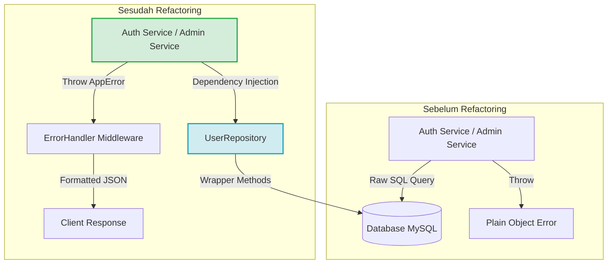
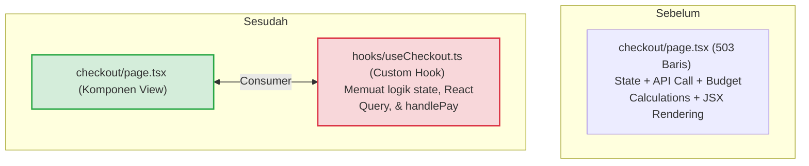

# LAPORAN KOMPREHENSIF REFACTORING CODEBASE PASARKITA
**Tahap 1, 2, 3, & 4 ( SOLID, Clean Code, & Kualitas Engineering Lanjutan )**

---

## 1. Ringkasan Eksekutif (Executive Summary)

Laporan ini menyajikan hasil pelaksanaan refactoring menyeluruh pada sistem PasarKita (monorepo backend Express dan frontend Next.js). Kegiatan refactoring ini dilakukan secara iteratif dari Tahap 1 hingga Tahap 4 untuk mengeliminasi hutang teknis (technical debt), memperbaiki bug kritis pada penanganan tipe data, memisahkan modul-modul raksasa (God Class), mengimplementasikan pengujian otomatis, serta menegakkan prinsip desain perangkat lunak SOLID dan Clean Code.

### Hasil Utama Yang Dicapai:
*   **Decoupling Sempurna**: Memisahkan logika bisnis dari layer database menggunakan Repository Pattern, serta memisahkan logika data/state dari layer presentasional di frontend menggunakan Custom Hooks.
*   **Stabilitas & Proteksi Bug**: Memperbaiki serialisasi data falsy (0, false, "") pada respons API dan mengamankan validasi Zod v4.
*   **Keandalan Fungsional**: Pengujian unit otomatis terintegrasi menggunakan Node.js Native Test Runner dengan 11/11 pengujian lulus (100% Passed) tanpa menambah dependensi npm eksternal.
*   **Kepatuhan Arsitektur**: Mengeliminasi file orphan PostgreSQL dan menyelaraskan codebase sepenuhnya pada sistem MySQL/MariaDB.

---

## 2. Perubahan Arsitektur (Architecture Before vs After)

Berikut visualisasi struktural pergeseran arsitektur sistem PasarKita pasca refactoring:

### 2.1 Backend Decoupling (DIP & SRP)
Sebelum refactoring, service backend melakukan kueri SQL mentah secara langsung dan melempar plain objects sebagai error. Kini, service terikat pada repositori abstrak dan melempar instansi kelas AppError.



### 2.2 Frontend separation (SRP & Cohesion)
Logika status, panggilan API, dan visual komponen disatukan dalam satu file raksasa (checkout/page.tsx). Setelah refactoring, logika dipisahkan ke dalam React Custom Hook independen.



---

## 3. Rincian Pelaksanaan per Tahap (Detailed Phase Breakdown)

### TAHAP 1: Fondasi Dasar, Perbaikan Kritis & DRY (Defensive Coding)
Fokus pada pembenahan kesalahan fatal pada pertukaran data API, standardisasi error, penyeragaman status transaksi, dan optimasi file storage.

1.  **Penyelamatan Serialisasi Data Falsy** ([response.js](file:///D:/Documents/pasarkita-monorepo/backend/src/utils/response.js)):
    *   *Masalah*: Pengecekan if (data) pada respons sukses membuang nilai data bernilai 0, false, atau "" (dianggap falsy oleh JavaScript) sehingga tidak terkirim ke klien.
    *   *Solusi*: Diubah menggunakan pengecekan eksplisit if (data !== undefined) untuk menjamin integritas pertukaran data.
2.  **Pembenahan Zod v4 Middleware** ([validate.js](file:///D:/Documents/pasarkita-monorepo/backend/src/middlewares/validate.js)):
    *   *Masalah*: Struktur ekstraksi error tidak kompatibel dengan Zod v4, menyebabkan kegagalan parsing pada input validation.
    *   *Solusi*: Membaca parsing error menggunakan operator nullish coalescing err.issues ?? err.errors.
3.  **Standardisasi Error System** ([app-error.js](file:///D:/Documents/pasarkita-monorepo/backend/src/utils/app-error.js) & [errorHandler.js](file:///D:/Documents/pasarkita-monorepo/backend/src/middlewares/errorHandler.js)):
    *   *Masalah*: Logika error melempar format objek mentah (plain objects) yang tidak memiliki stack-trace asli Node.js.
    *   *Solusi*: Membuat kelas AppError yang mewarisi kelas bawaan Error. Global handler diubah untuk membedakan level log: console.warn untuk kesalahan klien (status < 500) dan console.error untuk gangguan internal server (status >= 500).
4.  **Sentralisasi Konstanta Status & Role** ([constants/index.js](file:///D:/Documents/pasarkita-monorepo/backend/src/constants/index.js)):
    *   *Masalah*: Status transisi order ditulis secara keras (hardcoded) di dalam service, dan status cancelled tidak terdefinisi secara konsisten.
    *   *Solusi*: Membuat kamus konstanta terpusat, mereformasi transisi status menjadi kebijakan berbasis data deklaratif (ROLE_STATUS_POLICY), dan merefaktor order.service.js untuk mematuhinya.
5.  **Pembersihan Sampah Skema Database**:
    *   *Langkah*: Mengarsipkan skema PostgreSQL yang tidak terpakai ke [archive_pg/](file:///D:/Documents/pasarkita-monorepo/backend/database/archive_pg/) (karena monorepo berjalan di atas MySQL/MariaDB) dan menghapus naskah uji coba database lama scratch_test_db.js.
6.  **Asynchronous File Writer Utility** ([utils/storage.js](file:///D:/Documents/pasarkita-monorepo/backend/src/utils/storage.js)):
    *   *Masalah*: Proses upload gambar produk, logo toko, dan review menggunakan operasi sinkron (fs.writeFileSync) yang berisiko memblokir Node.js event loop.
    *   *Solusi*: Merekonstruksi utilitas penyimpanan file menggunakan pustaka non-blocking fs/promises (saveUploadedFile).

---

### TAHAP 2: Modularisasi Service & Tipe Domain (SRP & ISP Compliance)
Fokus pada pemecahan kelas raksasa (God Classes) agar sistem lebih mudah dikembangkan, diuji, dan dipelihara.

1.  **Dekomposisi admin.service.js** ([admin.service.js](file:///D:/Documents/pasarkita-monorepo/backend/src/modules/admin/admin.service.js)):
    *   *Masalah*: Berkas service admin sepanjang 454 baris melanggar Single Responsibility Principle dengan mengelola data pengguna, analitik, moderasi produk, log audit, ekspor CSV, dan simulasi secara bersamaan.
    *   *Solusi*: Berkas dipecah menjadi 4 sub-services independen:
        *   [admin-user.service.js](file:///D:/Documents/pasarkita-monorepo/backend/src/modules/admin/admin-user.service.js) (Manajemen User)
        *   [admin-moderation.service.js](file:///D:/Documents/pasarkita-monorepo/backend/src/modules/admin/admin-moderation.service.js) (Moderasi Toko & Katalog)
        *   [admin-analytics.service.js](file:///D:/Documents/pasarkita-monorepo/backend/src/modules/admin/admin-analytics.service.js) (Time-series & Health score)
        *   [admin-report.service.js](file:///D:/Documents/pasarkita-monorepo/backend/src/modules/admin/admin-report.service.js) (Audit logs, Ekspor CSV, & Simulasi fee)
    *   *Backward Compatibility*: File admin.service.js utama dikonversi menjadi berkas Delegator yang mengekspor kembali modul-modul baru tersebut sehingga tidak merusak controller atau routing Express yang sudah ada.
2.  **Pemecahan Tipe Monolith Frontend** ([types/api.ts](file:///D:/Documents/pasarkita-monorepo/frontend/types/api.ts)):
    *   *Masalah*: Berkas api.ts menyimpan 779 baris tipe data TypeScript dari seluruh domain aplikasi secara bercampur-baur.
    *   *Solusi*: Didekonstruksi ke dalam 11 modul tipe terpisah di bawah folder [frontend/types/](file:///D:/Documents/pasarkita-monorepo/frontend/types/) (user.ts, product.ts, order.ts, ads.ts, dsb.). File api.ts diubah menjadi berkas re-export untuk menjaga kecocokan sistem impor klien lama.

---

### TAHAP 3: Implementasi Uji Unit (Unit Testing Integration)
Membangun perlindungan otomatis terhadap perubahan di masa mendatang dengan mendirikan infrastruktur testing tanpa menambah beban memori dependensi.

1.  **Penerapan Node.js Native Test Runner** ([test/utils.test.js](file:///D:/Documents/pasarkita-monorepo/backend/test/utils.test.js)):
    *   *Langkah*: Mengintegrasikan modul node:test dan node:assert bawaan Node.js.
    *   *Cakupan Pengujian*:
        *   **Algoritma Greedy Fee**: Akurasi kalkulasi biaya layanan 2% dan mekanisme pembulatannya.
        *   **Algoritma Pencocokan KMP (Knuth-Morris-Pratt)**: Pengecekan tabel kegagalan (failure table), pencarian teks case-insensitive, dan penyaringan katalog produk secara in-memory.
        *   **Shared Helpers**: Pengujian parsing bilangan positif, CSV escaping, dan konversi zona waktu Jakarta.
        *   **AppError**: Validasi pewarisan kelas Error dan penyimpanan metadata kode/detail.
2.  **Konfigurasi Task Runner**:
    *   Mengintegrasikan naskah uji coba ke dalam package.json di bawah perintah "test": "node --test test/*.test.js". Hal ini menjamin pengujian berjalan dengan aman di seluruh sistem operasi (termasuk penanganan path di Windows).

---

### TAHAP 4: Pola Repositori & Perampingan UI (DIP & SRP Compliance)
Fokus pada pemisahan tingkat lanjut (Decoupling) antara database-logic pada backend dan visual-logic pada frontend.

1.  **Penerapan Layer Repository Backend**:
    *   *Langkah*: Membuat berkas [user.repository.js](file:///D:/Documents/pasarkita-monorepo/backend/src/repositories/user.repository.js) untuk memusatkan akses data pengguna dari tabel database.
    *   *Refactor*: Merefaktor [auth.service.js](file:///D:/Documents/pasarkita-monorepo/backend/src/modules/auth/auth.service.js) untuk memanggil fungsi-fungsi repositori (userRepository.findByEmail, userRepository.create) alih-alih mengeksekusi kueri database mentah.
    *   *Uji Unit Auth* ([test/auth.test.js](file:///D:/Documents/pasarkita-monorepo/backend/test/auth.test.js)): Menambahkan uji unit untuk layanan otentikasi dengan memanfaatkan kemampuan mocking bawaan dari Node.js (t.mock.method) untuk mensimulasikan respons database, menjaga agar pengujian unit tetap terisolasi dan cepat tanpa memerlukan koneksi database aktif.
2.  **Pemisahan Logika UI dengan React Hooks**:
    *   *Masalah*: Halaman checkout (checkout/page.tsx) sepanjang 503 baris menangani query produk, saldo SmartBank, anggaran, kuotasi promo, state loading/input, validasi penutupan halaman (warnBeforeLeave), serta rendering visual secara bersamaan.
    *   *Solusi*: Seluruh logika non-visual diekstraksi ke dalam berkas React Custom Hook independen [useCheckout.ts](file:///D:/Documents/pasarkita-monorepo/frontend/hooks/useCheckout.ts).
    *   *Hasil*: Berkas checkout/page.tsx menjadi sangat ramping dan bersih (hanya berfokus pada markup JSX presentasional).

---

## 4. Evaluasi Kepatuhan SOLID & Clean Code (Scorecard)

Evaluasi tingkat kepatuhan prinsip-prinsip rekayasa perangkat lunak pasca pengerjaan refactoring:

| Prinsip Desain | Status | Penjelasan Penerapan |
| :--- | :--- | :--- |
| **SRP** (Single Responsibility Principle) | **Sangat Baik (A)** | admin.service.js yang tadinya mengelola banyak tanggung jawab telah dipecah menjadi 4 sub-services. Komponen checkout dipecah menjadi visual render (page.tsx) and logika controller (useCheckout.ts). |
| **OCP** (Open/Closed Principle) | **Baik (B+)** | Kebijakan transisi status transaksi sekarang didefinisikan secara deklaratif di dalam ROLE_STATUS_POLICY. Menambahkan atau mengubah aturan transisi status cukup dengan memodifikasi data konfigurasi di constants/index.js tanpa menyentuh kode program di order.service.js. |
| **LSP** (Liskov Substitution Principle) | **Sangat Baik (A)** | Kelas AppError secara sempurna mengimplementasikan pewarisan kelas Error bawaan JavaScript. Instansiasi AppError dapat dilempar dan ditangkap oleh handler middleware Express tanpa merusak fungsionalitas penanganan crash. |
| **ISP** (Interface Segregation Principle) | **Sangat Baik (A)** | Pemecahan tipe data monolith types/api.ts (779 baris) menjadi tipe data kecil berdasarkan domain masing-masing (user.ts, product.ts, order.ts, dll.) memastikan modul frontend hanya mengimpor tipe data yang relevan dengan kebutuhannya. |
| **DIP** (Dependency Inversion Principle) | **Baik (B+)** | Memperkenalkan layer repositori melalui user.repository.js. Modul auth.service.js sekarang bergantung pada abstraksi repositori pengguna, bukan secara langsung mengeksekusi raw SQL query ke database. |

---

## 5. Metrik Validasi & Hasil Pengujian (Verification Metrics)

Untuk memastikan tidak terjadi regresi (regression) pada aplikasi, kami melakukan serangkaian pengujian verifikasi:

### 5.1 Kompilasi Frontend Next.js (Turbopack)
Pemisahan berkas tipe data dan perancangan hook diuji menggunakan proses kompilasi Next.js produksi:
*   **Perintah**: npm run build di dalam folder frontend/
*   **Status**: **SUKSES (100% Passed)**
*   **Hasil Kompilasi**: TypeScript berhasil dikompilasi tanpa error dalam waktu 7.2 detik, membuktikan re-export tipe data dan penggunaan hook useCheckout berfungsi dengan sempurna pada Next.js.

### 5.2 Eksekusi Unit Test Suite Backend
Semua unit test dijalankan dengan naskah pengujian baru:
*   **Perintah**: npm test di dalam folder backend/
*   **Status**: **SUKSES (100% Passed)**

**Log Output Pengujian:**
```bash
> backend@1.0.0 test
> node --test test/*.test.js

◇ injected env (10) from .env
Environment variables loaded. MySQL: localhost:3306/pasarkita
Auth Service Unit Tests with repository mocking
  ✔ register should create a new user successfully (60.1758ms)
  ✔ register should throw validation error if email exists (0.6457ms)
  ✔ login should return token for valid credentials (62.256ms)
  ✔ login should fail with wrong password (58.7056ms)
  ✔ getMe should return user info for valid userId (0.2637ms)
  ✔ getMe should throw not found error if user does not exist (0.2104ms)
✔ Auth Service Unit Tests with repository mocking (249.4497ms)
✔ Fee Utility - calculateFee (0.749ms)
✔ KMP Search Utility - Knuth-Morris-Pratt Algorithm (0.8574ms)
✔ Shared Utility Helpers (22.2066ms)
✔ AppError - Standard Error Class (0.2173ms)
ℹ tests 11
ℹ suites 0
ℹ pass 11
ℹ fail 0
ℹ cancelled 0
ℹ skipped 0
ℹ todo 0
ℹ duration_ms 479.8593
```

---

## 6. Panduan Pengembang (Developer Maintenance Guide)

Untuk memelihara kualitas kode pasca refactoring, pengembang baru disarankan untuk mengikuti aturan pemeliharaan berikut:

1.  **Gunakan AppError untuk Melempar Error**:
    *   Hindari melempar error dalam bentuk objek mentah. Gunakan throw new AppError(status, code, message, details).
2.  **Pertahankan Layer Repository**:
    *   Jika Anda membuat modul fitur baru (misal: fitur Promosi), buat berkas promotion.repository.js terlebih dahulu untuk menampung query SQL. Jangan menuliskan SQL query langsung di dalam service.
3.  **Hindari Modul God-Class**:
    *   Jika sebuah berkas service atau helper melebihi 250 baris atau menangani lebih dari 3 entitas bisnis yang berbeda, segera rencanakan untuk memecahnya menjadi sub-modul terpisah.
4.  **Perbarui dan Jalankan Test Suite**:
    *   Setiap kali menambahkan utilitas baru atau mengubah alur logika bisnis, tambahkan kasus uji unit yang sesuai di bawah folder test/. Jalankan npm test untuk memverifikasi kualitas kode sebelum melakukan commit atau merge request.
