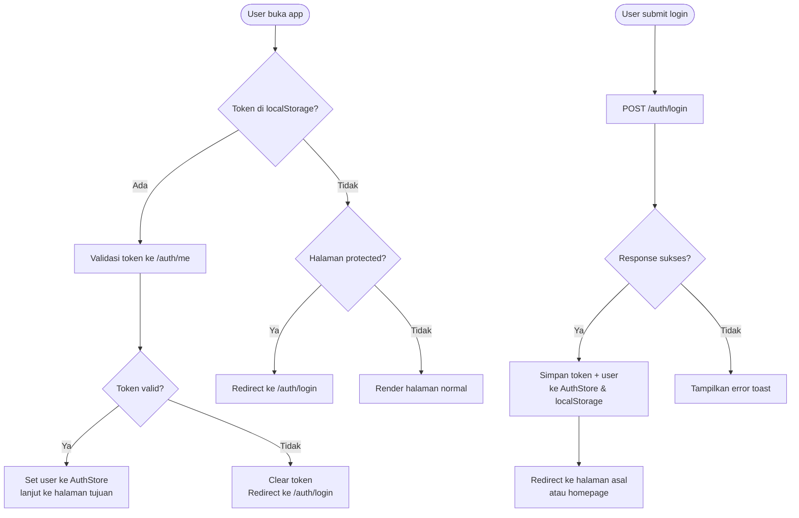
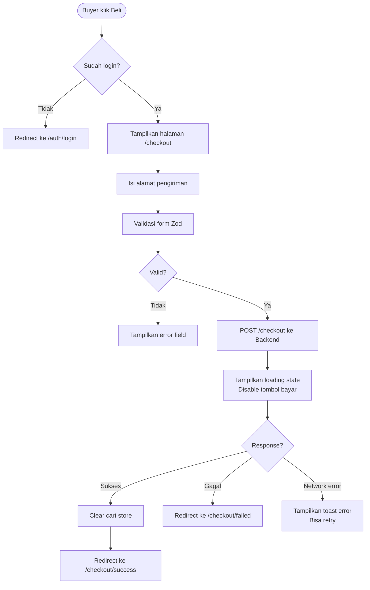
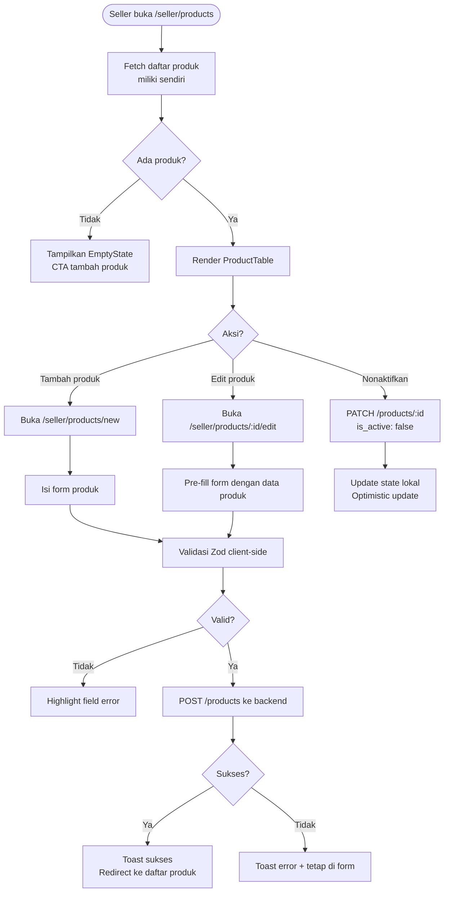

# PRD — Frontend

## Marketplace — PasarKita

**Mata Kuliah:** Rekayasa Perangkat Lunak 2
**Dosen:** M. Yusril Helmi Setyawan, S.Kom., M.Kom.
**Kelompok:** 2 — PasarKita (Marketplace)
**Dokumen:** Frontend Specification
**Versi:** 1.3
**Tanggal:** 18 April 2026

---

## 1. Overview

Dokumen ini mendeskripsikan spesifikasi teknis dan desain frontend PasarKita — mencakup design system, struktur halaman, komponen UI, state management, integrasi ke backend API, dan aturan responsivitas.

Frontend PasarKita dibangun menggunakan **Next.js 16.2 (App Router)** dengan **TypeScript**, berada di subfolder `frontend/` dalam satu repo GitHub bersama backend. Di-deploy ke Vercel sebagai project terpisah dengan Root Directory di-set ke `frontend`. Next.js 16.2 menggunakan **Turbopack** sebagai bundler default yang memberikan startup dev server ~400% lebih cepat dan rendering ~50% lebih cepat dibanding versi sebelumnya. Pendekatan desain mengutamakan **clean typography** dengan nuansa minimal, fungsional, dan mudah digunakan oleh seller maupun buyer dari berbagai latar belakang.

---

## 2. Tech Stack

| Komponen | Teknologi | Keterangan |
|---|---|---|
| Framework | Next.js 16.2 (App Router) | SSR + Client Components, Turbopack default |
| Language | TypeScript | Type safety |
| Styling | Tailwind CSS | Utility-first CSS |
| UI Components | shadcn/ui | Accessible, unstyled base |
| State Management | Zustand | Global state (auth, cart) |
| Server State | TanStack Query | Fetching, caching, revalidasi |
| Form | React Hook Form + Zod | Validasi form |
| HTTP Client | Axios | Request ke Backend API |
| Font | Inter (Google Fonts) | Variable font, semua weight |
| Icons | Lucide React | Konsisten dengan shadcn/ui |
| Toast Notifikasi | Sonner | Feedback aksi user |
| Bundler | Turbopack | Default di Next.js 16, ~400% faster dev startup |

---

## 3. Design System

### 3.1 Prinsip Desain

- **Clean & Functional** — tidak ada elemen dekoratif berlebihan, setiap elemen punya fungsi
- **Typography-first** — hierarki teks yang kuat menjadi backbone layout
- **Konsisten** — spacing, radius, warna menggunakan token yang sama di seluruh halaman
- **Accessible** — kontras minimum AA, keyboard navigable, screen reader friendly

### 3.2 Tipografi

```css
/* Font utama — Inter Variable */
@import url('https://fonts.googleapis.com/css2?family=Inter:ital,opsz,wght@0,14..32,100..900&display=swap');

font-family: 'Inter', ui-sans-serif, system-ui, sans-serif;
font-feature-settings: 'cv11', 'ss01'; /* Disambiguated chars, open digits */
```

| Role | Size | Weight | Line Height | Keterangan |
|---|---|---|---|---|
| Display | 48px | 700 | 1.1 | Hero headline |
| H1 | 32px | 600 | 1.2 | Page title |
| H2 | 24px | 600 | 1.3 | Section title |
| H3 | 18px | 500 | 1.4 | Card title, subheading |
| Body | 16px | 400 | 1.6 | Paragraf utama |
| Small | 14px | 400 | 1.5 | Label, caption |
| Micro | 12px | 400 | 1.4 | Badge, metadata |

### 3.3 Palet Warna

```css
:root {
  /* Neutral — backbone utama */
  --color-white:      #FFFFFF;
  --color-gray-50:    #F9FAFB;
  --color-gray-100:   #F3F4F6;
  --color-gray-200:   #E5E7EB;
  --color-gray-400:   #9CA3AF;
  --color-gray-600:   #4B5563;
  --color-gray-800:   #1F2937;
  --color-gray-900:   #111827;

  /* Primary — aksi utama */
  --color-primary:        #111827; /* Hitam hangat */
  --color-primary-hover:  #374151;

  /* Accent — highlight & status */
  --color-accent:     #2563EB; /* Biru solid */
  --color-success:    #16A34A;
  --color-warning:    #D97706;
  --color-danger:     #DC2626;

  /* Surface */
  --color-bg:         #FFFFFF;
  --color-bg-subtle:  #F9FAFB;
  --color-border:     #E5E7EB;
  --color-border-strong: #D1D5DB;
}
```

### 3.4 Spacing Scale

Menggunakan skala 4px base (Tailwind default):

| Token | Value | Contoh penggunaan |
|---|---|---|
| space-1 | 4px | Gap antar icon & teks |
| space-2 | 8px | Padding badge, margin kecil |
| space-3 | 12px | Gap dalam card |
| space-4 | 16px | Padding komponen |
| space-6 | 24px | Gap antar section dalam page |
| space-8 | 32px | Margin antar section besar |
| space-12 | 48px | Padding section utama |
| space-16 | 64px | Jarak antar blok besar |

### 3.5 Border Radius

```css
--radius-sm:   4px;   /* Badge, input kecil */
--radius-md:   8px;   /* Button, input */
--radius-lg:   12px;  /* Card produk */
--radius-xl:   16px;  /* Modal, panel besar */
--radius-full: 9999px; /* Pill, avatar */
```

### 3.6 Komponen Dasar

**Button:**
```
Primary   → bg hitam, teks putih, hover bg-gray-800
Secondary → bg putih, border 1px, hover bg-gray-50
Ghost     → transparan, hover bg-gray-100
Danger    → bg merah, teks putih
```

**Input:**
```
Height: 40px
Border: 1px solid --color-border
Radius: --radius-md
Focus: ring 2px --color-accent
```

**Card Produk:**
```
Border: 1px solid --color-border
Radius: --radius-lg
Padding: 16px
Hover: shadow-sm + border-strong
Transition: 150ms ease
```

---

## 4. Struktur Halaman & Routing

### 4.1 Route Map

```
/                         → Homepage (browse semua produk)
/auth/login               → Halaman login
/auth/register            → Halaman registrasi

/products                 → Daftar semua produk (browse)
/products/[id]            → Detail produk
/checkout                 → Halaman checkout
/checkout/success         → Konfirmasi order berhasil
/checkout/failed          → Konfirmasi order gagal

/orders                   → Daftar order buyer
/orders/[id]              → Detail order

/seller/products          → Daftar produk milik seller
/seller/products/new      → Form tambah produk baru
/seller/products/[id]/edit → Form edit produk

/admin                    → Dashboard superadmin
/admin/users              → Manajemen semua user
/admin/orders             → Semua order ekosistem
/admin/analytics          → Dashboard analytics & revenue
```

### 4.2 Layout Hierarchy

```
RootLayout (font, theme, providers)
├── (auth) AuthLayout — centered card, no navbar
│   ├── /auth/login
│   └── /auth/register
│
├── (main) MainLayout — navbar + footer
│   ├── /
│   ├── /products
│   ├── /products/[id]
│   ├── /checkout
│   ├── /orders
│   └── /orders/[id]
│
├── (seller) SellerLayout — sidebar + main
│   └── /seller/**
│
└── (admin) AdminLayout — sidebar + main
    └── /admin/**
```

---

## 5. Halaman & Komponen

### 5.1 Navbar

Komponen global di semua halaman `(main)`:

```
[Logo PasarKita]    [Browse]    [Pesanan Saya]    [Jual Produk]    [Avatar / Login]
```

- Logo klik ke `/`
- Avatar dropdown: Profile, Keluar
- Seller yang login: tambah link "Dashboard Toko"
- Superadmin: tambah link "Admin Panel"
- Mobile: hamburger menu

---

### 5.2 Homepage `/`

**Sections:**
1. **Hero** — tagline singkat + search bar produk
2. **Produk Terbaru** — grid 4 kolom, 8 produk pertama
3. **Kategori** — pill/chip kategori yang bisa diklik
4. **CTA Seller** — banner ajak seller bergabung

**Komponen:**
- `<SearchBar />` — input search, submit ke `/products?search=...`
- `<ProductGrid />` — reusable, dipakai di banyak halaman
- `<ProductCard />` — gambar, nama, harga, seller, tombol lihat detail
- `<CategoryPills />` — list kategori yang bisa difilter

---

### 5.3 Browse Produk `/products`

**Layout:** Sidebar filter (kiri) + Grid produk (kanan)

**Filter sidebar:**
- Kategori (checkbox)
- Range harga (slider)
- Urutkan (dropdown: terbaru, harga terendah, harga tertinggi)

**State URL-based:**
```
/products?search=batik&category=fashion&sort=price_asc&page=2
```

Nilai `sort` yang valid sesuai backend: `price_asc`, `price_desc`, `newest` — harus konsisten dengan query param yang diterima `GET /api/products`.

Filter tersimpan di URL query params sehingga bisa dishare dan di-bookmark.

**Komponen:**
- `<FilterSidebar />` — filter kategori, harga, sort
- `<ProductGrid />` — grid responsif
- `<Pagination />` — navigasi halaman
- `<EmptyState />` — tampilan jika tidak ada produk ditemukan

---

### 5.4 Detail Produk `/products/[id]`

**Layout:** 2 kolom — gambar (kiri) + info + aksi (kanan)

**Konten:**
- Gambar produk (atau placeholder jika tidak ada)
- Nama produk, kategori, harga
- Deskripsi produk
- Info seller (nama toko)
- Input qty + tombol Checkout
- Simulasi total + fee 2% ditampilkan sebelum checkout

**Komponen:**
- `<ProductImage />` — gambar dengan fallback placeholder
- `<QuantityInput />` — input angka dengan tombol +/−
- `<FeePreview />` — memanggil `POST /api/fee/calculate` dengan `product_id` + `qty`, tampilkan subtotal, fee 2%, dan total dari response backend
- `<CheckoutButton />` — disabled jika stok 0 atau user belum login

---

### 5.5 Checkout `/checkout`

**Layout:** 2 kolom — ringkasan order (kiri) + form alamat & aksi (kanan)

**Konten:**
- Ringkasan item yang dibeli (nama, qty, harga)
- Form input alamat pengiriman
- Breakdown biaya: subtotal + fee marketplace 2% + estimasi total
- Tombol Bayar Sekarang
- Loading state saat menunggu response SmartBank

**State checkout:**
```typescript
type CheckoutState = {
  items: CartItem[]
  shippingAddress: string
  subtotal: number
  feeMarketplace: number
  total: number
  status: 'idle' | 'processing' | 'success' | 'failed'
}
```

**Komponen:**
- `<OrderSummary />` — daftar item + harga
- `<ShippingForm />` — input alamat dengan validasi
- `<PriceBreakdown />` — breakdown biaya + total
- `<PayButton />` — tombol dengan loading spinner

---

### 5.6 Konfirmasi Order

**`/checkout/success`**
- Icon centang hijau
- Nomor order
- Total yang dibayar
- Status pengiriman awal
- Tombol: Lihat Detail Order / Lanjut Belanja

**`/checkout/failed`**
- Icon X merah
- Pesan alasan gagal (dari response SmartBank)
- Tombol: Coba Lagi / Kembali ke Produk

---

### 5.7 Daftar Order Buyer `/orders`

**Layout:** List order dengan filter status

**Tab filter:** Semua | Pending | Dibayar | Dikirim | Selesai | Gagal

**Per item order:**
- Nomor order, tanggal
- Item yang dibeli (preview nama + qty)
- Total bayar
- Status badge (color-coded)
- Tombol Lihat Detail

---

### 5.8 Detail Order `/orders/[id]`

**Konten:**
- Header: nomor order + status badge
- Timeline status order
- Daftar item yang dibeli
- Info pengiriman (alamat + tracking ID dari LogistiKita)
- Breakdown pembayaran (subtotal, fee, total)
- transaction_id dari SmartBank

---

### 5.9 Dashboard Seller `/seller/products`

**Layout:** Sidebar + tabel produk

**Fitur:**
- Tabel semua produk milik seller (nama, stok, harga, status aktif)
- Tombol Tambah Produk
- Aksi per baris: Edit, Nonaktifkan

**Komponen:**
- `<ProductTable />` — tabel dengan sorting
- `<ProductStatusToggle />` — toggle aktif/nonaktif
- `<EmptySellerState />` — CTA tambah produk pertama

---

### 5.10 Form Produk `/seller/products/new` & `/seller/products/[id]/edit`

**Field:**
- Nama Produk (text, required)
- Deskripsi (textarea)
- Kategori (select)
- Harga (number, min 1000)
- Stok (number, min 0)

**Validasi client-side dengan Zod:**
```typescript
const productSchema = z.object({
  name: z.string().min(3).max(200),
  description: z.string().optional(),
  category: z.string().min(1),
  price: z.number().min(1000),
  stock: z.number().min(0),
})
```

---

### 5.11 Admin Dashboard `/admin`

**Layout:** Sidebar navigasi + konten

**Sidebar menu:**
- Dashboard (overview)
- Semua User
- Semua Order
- Analytics

**`/admin` — Overview:**
- Metric cards: total user, total produk, total order hari ini, total revenue
- Grafik sederhana: order per hari (7 hari terakhir)
- Tabel order terbaru (5 terakhir)

**`/admin/users` — Manajemen User:**
- Tabel semua user (nama, email, role, status aktif, tanggal daftar)
- Filter by role, status
- Aksi: Ban / Aktifkan user

**`/admin/orders` — Semua Order:**
- Tabel semua order dari semua buyer
- Filter by status, tanggal
- Aksi: Update status order manual

**`/admin/analytics` — Analytics:**

Data dari `GET /api/admin/analytics`. Sesuai response backend, yang tersedia adalah:
- Total revenue, total fee marketplace, total orders, total users, total products (`summary`)
- Breakdown order berdasarkan status: paid, pending, payment_failed, delivered (`orders_by_status`) — ditampilkan sebagai pie chart atau card breakdown
- Top 5 produk terlaris (`top_products`) — ditampilkan sebagai tabel
- Filter by `start` dan `end` date

> **Catatan:** Backend tidak menyediakan data orders per hari. Jika grafik time-series dibutuhkan, perlu koordinasi dengan backend untuk tambah field `orders_per_day` ke response analytics.

---

## 6. State Management

### 6.1 Auth Store (Zustand)

```typescript
type AuthStore = {
  user: User | null
  token: string | null
  isAuthenticated: boolean
  login: (token: string, user: User) => void
  logout: () => void
}
```

Token disimpan di dua tempat secara bersamaan:
- **Cookie** (`token`) — dibaca oleh Next.js middleware untuk proteksi route server-side
- **Zustand state** — dibaca oleh Axios interceptor untuk inject ke header `Authorization`

```typescript
// store/auth.ts
const useAuthStore = create<AuthStore>((set) => ({
  user: null,
  token: null,
  isAuthenticated: false,
  login: (token, user) => {
    // Simpan ke cookie agar middleware bisa baca
    document.cookie = `token=${token}; path=/; max-age=86400; SameSite=Strict`
    set({ user, token, isAuthenticated: true })
  },
  logout: () => {
    document.cookie = 'token=; path=/; max-age=0'
    set({ user: null, token: null, isAuthenticated: false })
  }
}))
```

### 6.2 Cart Store (Zustand)

```typescript
type CartItem = {
  productId: string   // camelCase di store
  name: string
  price: number
  qty: number
  sellerName: string
}

type CartStore = {
  items: CartItem[]
  addItem: (item: CartItem) => void
  removeItem: (productId: string) => void
  updateQty: (productId: string, qty: number) => void
  clearCart: () => void
  total: () => number
}
```

**Mapping ke payload backend saat checkout** — backend menggunakan `snake_case`:

```typescript
// Saat kirim ke POST /api/checkout, mapping dari CartItem ke backend format
const buildCheckoutPayload = (items: CartItem[], shippingAddress: string) => ({
  items: items.map(item => ({
    product_id: item.productId,  // camelCase → snake_case
    qty: item.qty
  })),
  shipping_address: shippingAddress
})
```

### 6.3 Server State (TanStack Query)

```typescript
// Contoh query produk
const { data: products, isLoading } = useQuery({
  queryKey: ['products', filters],
  queryFn: () => fetchProducts(filters),
  staleTime: 30_000, // 30 detik
})

// Contoh mutation checkout
const checkoutMutation = useMutation({
  mutationFn: (payload: CheckoutPayload) => checkout(payload),
  onSuccess: (res) => {
    // Backend response shape: { success: true, data: { order_id, status, ... } }
    cartStore.clearCart()
    router.push(`/checkout/success?orderId=${res.data.order_id}`)
  },
  onError: (err: AxiosError<ApiErrorResponse>) => {
    const code = err.response?.data?.error?.code
    // Handle spesifik per error code dari backend
    if (code === 'TRANSACTION_COOLDOWN') {
      const retryAfter = err.response?.data?.error?.retry_after
      toast.error(`Tunggu ${retryAfter} detik sebelum transaksi berikutnya`)
      return
    }
    if (code === 'DAILY_LIMIT_EXCEEDED') {
      toast.error('Batas 10 transaksi harian telah tercapai')
      return
    }
    if (code === 'INSUFFICIENT_STOCK') {
      toast.error(err.response?.data?.error?.details ?? 'Stok tidak mencukupi')
      return
    }
    // Fallback untuk PAYMENT_FAILED dan error lain
    router.push('/checkout/failed')
  }
})
```

### 6.4 TypeScript Types — Sesuai Response Backend

```typescript
// types/api.ts

// Sesuai response GET /api/products
type Product = {
  id: string
  name: string
  description: string
  category: string
  price: number       // integer, bukan float
  stock: number
  is_active: boolean
  seller: {
    id: string
    name: string
  }
}

// Sesuai response GET /api/orders
type Order = {
  id: string
  status: 'pending' | 'paid' | 'shipped' | 'delivered' | 'payment_failed'
  subtotal: number
  fee_marketplace: number
  total: number
  shipping_address: string
  transaction_id: string | null   // null jika payment belum sukses
  tracking_id: string | null      // null jika belum di-trigger ke LogistiKita
  created_at: string
  items: OrderItem[]
}

type OrderItem = {
  product_id: string
  product_name: string
  qty: number
  price_at_purchase: number  // snapshot harga saat beli
}

// Sesuai response POST /api/checkout (sukses)
type CheckoutResponse = {
  order_id: string
  status: 'paid'
  subtotal: number
  fee_marketplace: number
  total: number
  transaction_id: string
  shipping: {
    tracking_id: string
    status: string
  }
}

// Sesuai response GET /api/admin/analytics
type AnalyticsSummary = {
  period: string
  summary: {
    total_orders: number
    total_revenue: number
    total_fee_marketplace: number
    total_users: number
    total_products: number
  }
  orders_by_status: {
    paid: number
    pending: number
    payment_failed: number
    delivered: number
  }
  top_products: Array<{
    product_id: string
    name: string
    total_sold: number
  }>
}

// Wrapper standar semua response backend
type ApiResponse<T> = {
  success: boolean
  message: string
  data: T
}

type ApiErrorResponse = {
  success: false
  message: string
  error: {
    code: string
    details?: string
    retry_after?: number
  }
}

type PaginatedResponse<T> = ApiResponse<T[]> & {
  pagination: {
    page: number
    limit: number
    total: number
    total_pages: number
  }
}
```

---

## 7. Integrasi ke Backend API

### 7.1 Axios Instance

```typescript
// lib/api.ts
import axios from 'axios'
import { useAuthStore } from '@/store/auth'

export const api = axios.create({
  baseURL: process.env.NEXT_PUBLIC_API_URL,
  timeout: 10_000,
})

api.interceptors.request.use((config) => {
  const token = useAuthStore.getState().token
  if (token) config.headers.Authorization = `Bearer ${token}`
  return config
})

api.interceptors.response.use(
  (res) => res,
  (err) => {
    if (err.response?.status === 401) {
      useAuthStore.getState().logout()
      window.location.href = '/auth/login'
    }
    return Promise.reject(err)
  }
)
```

### 7.2 API Functions — Mapping ke Backend Endpoint

Semua request ke backend ditulis dalam satu file per modul agar mudah dilacak saat ada perubahan kontrak:

```typescript
// lib/api/auth.ts
export const authApi = {
  register: (body: { name: string; email: string; password: string; role: 'buyer' | 'seller' }) =>
    api.post<ApiResponse<{ id: string; name: string; email: string; role: string }>>('/auth/register', body),

  login: (body: { email: string; password: string }) =>
    api.post<ApiResponse<{ token: string; user: { id: string; name: string; role: string } }>>('/auth/login', body),

  me: () =>
    api.get<ApiResponse<{ id: string; name: string; email: string; role: string }>>('/auth/me'),
}

// lib/api/products.ts
export const productsApi = {
  getAll: (params?: { search?: string; category?: string; sort?: string; page?: number; limit?: number }) =>
    api.get<PaginatedResponse<Product>>('/products', { params }),

  getById: (id: string) =>
    api.get<ApiResponse<Product>>(`/products/${id}`),

  create: (body: { name: string; description?: string; category: string; price: number; stock: number }) =>
    api.post<ApiResponse<Product>>('/products', body),

  update: (id: string, body: Partial<{ name: string; description: string; category: string; price: number; stock: number }>) =>
    api.put<ApiResponse<Product>>(`/products/${id}`, body),

  delete: (id: string) =>
    api.delete<ApiResponse<null>>(`/products/${id}`),
}

// lib/api/checkout.ts
export const checkoutApi = {
  checkout: (body: { items: { product_id: string; qty: number }[]; shipping_address: string }) =>
    api.post<ApiResponse<CheckoutResponse>>('/checkout', body),

  calculateFee: (body: { items: { product_id: string; qty: number }[] }) =>
    api.post<ApiResponse<{ subtotal: number; fee_marketplace: number; fee_percentage: number; total: number }>>('/fee/calculate', body),
}

// lib/api/orders.ts
export const ordersApi = {
  getAll: (params?: { status?: string; page?: number; limit?: number }) =>
    api.get<PaginatedResponse<Order>>('/orders', { params }),

  getById: (id: string) =>
    api.get<ApiResponse<Order>>(`/orders/${id}`),

  updateStatus: (id: string, body: { status: string }) =>
    api.patch<ApiResponse<Order>>(`/orders/${id}/status`, body),
}

// lib/api/admin.ts
export const adminApi = {
  getUsers: (params?: { role?: string; status?: string; page?: number; limit?: number }) =>
    api.get<PaginatedResponse<User>>('/admin/users', { params }),

  updateUserStatus: (id: string, body: { is_active: boolean; reason?: string }) =>
    api.patch<ApiResponse<{ id: string; is_active: boolean }>>(`/admin/users/${id}/status`, body),

  getAnalytics: (params?: { period?: string; start?: string; end?: string }) =>
    api.get<ApiResponse<AnalyticsSummary>>('/admin/analytics', { params }),
}
```

### 7.3 Environment Variable

```env
NEXT_PUBLIC_API_URL=https://pasarkita-api.vercel.app
```

### 7.4 Setup Project

```bash
# 1. Clone / init repo
git clone https://github.com/your-org/pasarkita.git
cd pasarkita

# 2. Buat subfolder frontend dengan Next.js 16.2
npx create-next-app@latest frontend \
  --typescript \
  --tailwind \
  --app

# 3. Masuk ke folder frontend
cd frontend

# 4. Install dependencies tambahan
npm install zustand @tanstack/react-query axios react-hook-form zod @hookform/resolvers sonner lucide-react

# 5. Install shadcn/ui
npx shadcn@latest init
```

**Vercel deployment** — buat project baru di Vercel, pilih repo `pasarkita`, lalu set:
```
Root Directory: frontend
```

> **Catatan:** Turbopack sudah jadi default di Next.js 16 — tidak perlu flag `--turbopack` terpisah saat `next dev`. Jika ingin tetap pakai Webpack untuk kompatibilitas library tertentu, tambahkan `--no-turbopack` saat dev.

---

## 8. Proteksi Route

Menggunakan middleware Next.js untuk redirect berdasarkan role:

```typescript
// middleware.ts
import { NextRequest, NextResponse } from 'next/server'

export async function middleware(req: NextRequest) {
  // Next.js 16: cookies() adalah async
  const token = req.cookies.get('token')?.value
  const { pathname } = req.nextUrl

  const protectedRoutes = ['/checkout', '/orders', '/seller', '/admin']

  if (protectedRoutes.some(r => pathname.startsWith(r)) && !token) {
    return NextResponse.redirect(new URL('/auth/login', req.url))
  }

  return NextResponse.next()
}

export const config = {
  matcher: ['/checkout/:path*', '/orders/:path*', '/seller/:path*', '/admin/:path*']
}
```

| Route | Akses |
|---|---|
| `/`, `/products`, `/products/[id]` | Public |
| `/auth/login`, `/auth/register` | Guest only (redirect jika sudah login) |
| `/checkout`, `/orders` | buyer, seller, superadmin |
| `/seller/**` | seller, superadmin |
| `/admin/**` | superadmin only |

---

## 9. Responsivitas

| Breakpoint | Width | Layout |
|---|---|---|
| Mobile | < 640px | 1 kolom, hamburger menu |
| Tablet | 640–1024px | 2 kolom grid produk, sidebar collapsible |
| Desktop | > 1024px | 4 kolom grid produk, sidebar tetap |

**Komponen yang adapt:**
- `<ProductGrid />` — `grid-cols-1 sm:grid-cols-2 lg:grid-cols-4`
- `<FilterSidebar />` — drawer di mobile, sticky di desktop
- `<Navbar />` — hamburger di mobile, full di desktop
- `<CheckoutLayout />` — stack di mobile, 2 kolom di desktop

---

## 10. Workflow Diagram

### 10.1 Alur Autentikasi (Frontend)



### 10.2 Alur Checkout (Frontend)



### 10.3 Alur Seller Kelola Produk (Frontend)



---

## 11. Skenario Testing Frontend

### 11.1 Unit Test Komponen

Menggunakan **Vitest** + **React Testing Library**:

| Komponen | Skenario |
|---|---|
| `<QuantityInput />` | Tidak bisa di bawah 1, tidak bisa melebihi stok |
| `<FeePreview />` | Kalkulasi 2% tampil benar untuk berbagai nominal |
| `<CheckoutButton />` | Disabled jika stok 0 atau user belum login |
| `<ProductCard />` | Render nama, harga, seller dengan benar |
| `<PriceBreakdown />` | Total = subtotal + fee, tanpa floating point error |

### 11.2 Integration Test

| Skenario | Expected |
|---|---|
| Login dengan kredensial valid | Token tersimpan, redirect ke homepage |
| Login dengan password salah | Toast error, tetap di halaman login |
| Browse produk tanpa login | Halaman muncul normal |
| Klik checkout tanpa login | Redirect ke /auth/login |
| Submit checkout sukses | Redirect ke /checkout/success |
| Submit checkout gagal (mock API gagal) | Redirect ke /checkout/failed |
| Seller buka /admin | Redirect atau 403 |
| Superadmin buka /seller | Bisa akses |

### 11.3 Manual Testing Checklist

- [ ] Semua halaman responsive di mobile (375px)
- [ ] Keyboard navigation berjalan di form dan dropdown
- [ ] Loading state muncul saat fetch data
- [ ] Error state muncul jika API gagal
- [ ] Toast notifikasi muncul untuk setiap aksi penting
- [ ] Token expired → otomatis logout dan redirect
- [ ] Filter produk tersimpan di URL (refresh tidak hilang)

---

## 12. Risiko & Mitigasi

| Risiko | Dampak | Mitigasi |
|---|---|---|
| Backend API belum ready | Tidak bisa develop fitur yang butuh data | Gunakan mock data + MSW (Mock Service Worker) |
| Cold start backend Vercel | UI terasa lambat response pertama | Tampilkan skeleton loading agar tidak terasa kosong |
| Token expired saat proses checkout | User terpental logout di tengah checkout | Cek validitas token sebelum submit checkout, refresh jika bisa |
| Tampilan rusak di browser lama | Sebagian user tidak bisa menggunakan app | Test di Chrome, Firefox, Safari minimum |
| Hydration mismatch SSR vs Client | Error di console, UI kedip | Gunakan `suppressHydrationWarning` untuk elemen berbasis waktu |